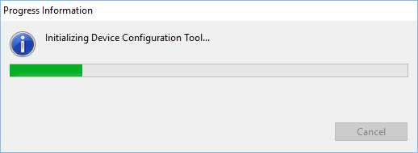
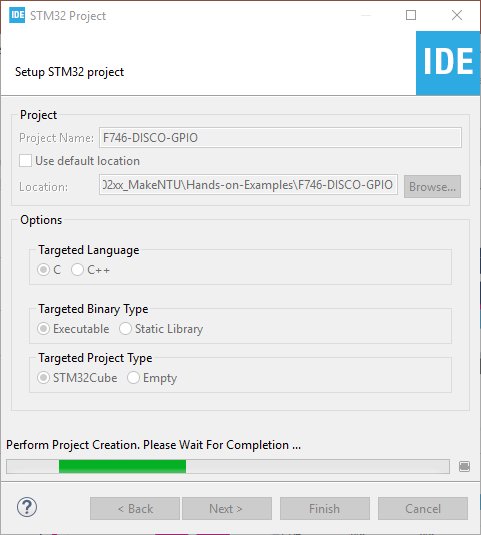
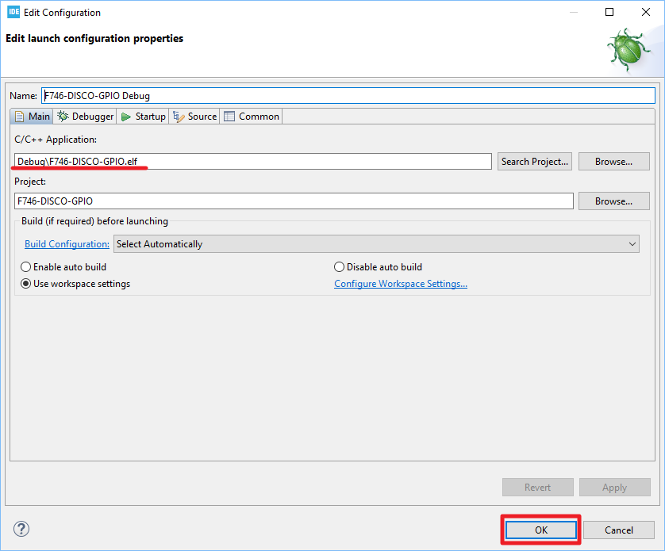

# Hands-on: GPIO Output

主要流程：
1. 開啟CubeIDE

2. MCU選擇

3. 設定腳位功能並產生程式碼

4. 新增程式碼

5. 編譯專案

6. 執行專案

7. 使用除錯功能

   

## 一、開啟CubeIDE
1. 開啟CubeIDE之後會出現如下的workspace選擇，在此可以選擇預設的workspace路徑或是另行指定路徑：  
   
2. 在Workspace選定之後會出現如下的啟動畫面：  
   
3. 若是初次啟用CubeIDE的話會出現如下.cproject檔案關聯的對話框。若你的電腦當中有其它的Eclipse類的IDE，建議在此選取「No」，並且同時勾選「Remember my decision」，如此CubeIDE在後續的操作過程中就不會再次出現此對話框以節省操作時間：  
   
4. 若是初次啟用CubeIDE的話會接著出現如下.project檔案關聯的對話框。同樣的，若你的電腦當中有其它的Eclipse類的IDE，建議在此選取「No」，並且同時勾選「Remember my decision」，如此CubeIDE在後續的操作過程中就不會再次出現此對話框以節省操作時間：  
   

## 二、MCU選擇
1. 啟動畫面結束之後會進入如下的「Information Center」畫面，在此點選左側的「Start new STM32 project」按鈕：  
   
2. 接著會出現初始化進度條的畫面。此步驟會花費一些時間請耐心等待：  
   
3. 接著出現如下的MCU選擇工具（Target Selection）。請點選中間的「Board Selector」分頁，並在「Part Number Search」當中輸入「32F746」，接著在畫面的右側篩選出了32F746GDISCOVERY開發板。點選畫面右側的32F746GDISCOVERY開發板，然後點選「Next >」按鈕：  
   
4. 接著出現如下的專案設定畫面。在「Project Name」輸入專案名程，例如「F746-DISCO-GPIO」，並取消「Use default location」的選取狀態，然後在「Location」處輸入專案路徑，完成後點選「Finish」鈕：
   
   
   NOTE: 在「Location」處輸入的專案路徑不能有空格。
   
5. 出現如下的對話框時請選取「No」：  
    
NOTE: 若此處選取「Yes」，則會開啟許多目前不會用到的Middleware造成專案處理上的複雜度。
   
6. 接著若出現如下的對話框，點選「Yes」並建議勾選「Remember my decision」，如此CubeIDE在後續的操作過程中就不會再次出現此對話框以節省操作時間：  
    
7. 接著是工具的初始化進度條的畫面。同樣的，此步驟會花費一些時間請耐心等待：  
   
8. 工具初始化結束之後是專案初始化，同樣的，此步驟會花費一些時間請耐心等待：  
   
9. 專案初始化結束之後會看到如下的畫面：  
   
   NOTE: 左側可看到專案目錄的目錄結構，右側可看到IOC Editor，可用來設定腳位及週邊控制器的操作參數。

##  三、設定腳位功能並產生程式碼
1. 在畫面右側的IOC Editor中搜尋PI1腳位：  
   
2. 將PI1設定為GPIO_Output：  
   
3. 在CubeIDE上方的選單當中點選「Project -> Generate Code」以產生程式碼和專案檔：  
   

## 四、新增程式碼
1. 開啟「Core\Src\main.c」檔：  
   
2. 在main.c的USER CODE Block 3當中新增如下程式碼：
   ```c
          /* USER CODE BEGIN 3 */
          HAL_Delay(500);
          HAL_GPIO_TogglePin(GPIOI, GPIO_PIN_1);
        }
        /* USER CODE END 3 */
   ```
   NOTE: 在以上的程式碼輸入過程中可試用**Auto-complete** 的功能！

## 五、編譯專案
1. 點選專案圖示後按下滑鼠右鍵以開啟選單，並選取「Build Project」以進行編譯：  
      
2. 編譯完成之後在「Console」檢查編譯訊息以確認編譯是否成功：  
   

## 六、執行專案
1. 點選專案圖示後按下滑鼠右鍵以開啟選單，並選取「Debug As --> 2 STM32 MCU C/C++ Application」以開啟除錯功能的設定：  
   
   
2. 除錯功能的設定畫面如下，確認「C/C++ Application」當中有指定ELF執行檔無誤後，點選「OK」按鈕以開啟除錯功能：  
   
   
3. 開啟除錯功能的過程中若出現以下的對話框時請點選「Switch」，並建議勾選「Remember my decision」，如此CubeIDE在後續的操作過程中就不會再次出現此對話框以節省操作時間：  
   
   
   
   NOTE: 
   
   1. 接下來若出現以下的警示畫面，代表需要更新ST-LINK的韌體：  
      
   2. 點選「OK」之後出現以下畫面，點選「Yes」以開啟STLinkUpgrade程式：  
      
   3. 在STLINKUpgrade畫面中，點選「Open in update mode」按鈕：  
      
   4. 接著點選「Upgrade」按鈕：  
      
   5. 韌體更新中：  
      
   6. 更新完成之後即可按畫面右上角的「X」以關閉視窗：  
      
   
   
   
4. 除錯功能順利啟動之後，可看到程式停在預設的中斷點，即main函式的第一行。此時按下「Resume」之後程式便開啟執行：  
   

5. 執行時可看到LD1每隔500 ms會閃滅一次：  
   

## 七、使用除錯功能
### 1. 設置中斷點
1. 在程式執行過中當中，於main.c第104行處連續按滑鼠左鍵二次即可在此設定中斷點。中斷點設定之後，程式會很快的停在此處：  
   
2. 按下「Resume」之後程式繼續執行，但很快的（500 ms）又會停在此中斷點：  
   
### 2. 使用Live Expressions
1. 在「Live Expressions」當中點選「Add new expression」以新增欲觀察的變數（在此以uwTick為例）：  
   
2. 新增完畢之後，在程式執行時即可看到變數的即時變化：  
   
   NOTE: Local變數無法藉由Live Expressions來觀看即時變化。