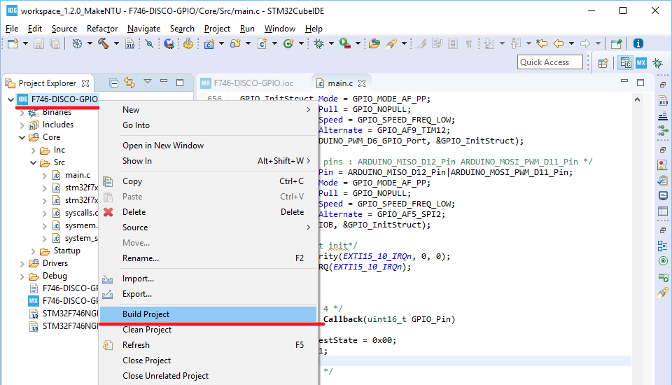

# Hands-on: GPIO Interrupt

- 主要流程：
  1. 設定腳位功能並產生程式碼
  4. 新增程式碼
  5. 編譯專案
  6. 執行專案
  7. 使用除錯功能

##  一、設定腳位功能並產生程式碼
1. 承續01_GPIO_Output，在畫面右側的IOC Editor中搜尋「PI11」腳位：  
   
2. 將「PI11」設定為「GPIO_EXTI11」：  
   
3. 將「System Core」展開後點選「GPIO」，接著點選中間「Configuration」設定畫面的「NVIC」分頁，並勾選EXTI line[15:10] interrupt的「Enable」：  
   
4. 在CubeIDE上方的選單當中點選「Project -> Generate Code」以產生程式碼：  
   

## 二、新增程式碼
1. 開啟「Core\Src\main.c」檔：  
   
2. 在main.c的USER CODE Block 3當中將前一個實作所加的程式碼刪除，最後結果如下（區塊內是空的）：
   ```c
       /* USER CODE BEGIN 3 */
   
     }
     /* USER CODE END 3 */
   ```
   NOTE: 將程式碼刪除之後，請同時將原本所設定的中斷點移除。中斷點移除的方法和設定的方法一樣，在中斷點處連續按滑鼠左鍵二次即可取消此中斷點。
   
3. 在main.c的USER CODE Block 4當中新增如下程式碼：
   ```c
   /* USER CODE BEGIN 4 */
   void HAL_GPIO_EXTI_Callback(uint16_t GPIO_Pin)
   {
     static uint8_t testState = 0x00;
     testState ^= 0x01;
     HAL_GPIO_TogglePin(GPIOI, GPIO_PIN_1);
   }
   /* USER CODE END 4 */
   ```

## 三、編譯專案
1. 在專案圖示處按下滑鼠右鍵，並選取「Build Project」以進行編譯：   
   
2. 編譯完成之後在「Console」檢查編譯訊息以確認編譯是否成功：  
   

## 四、執行專案
1. 在專案圖示處按下滑鼠右鍵，並選取「Debug As --> 2 STM32 MCU C/C++ Application」以開啟除錯功能：  
   
2. 除錯功能順利啟動之後，可看到程式停在預設的中斷點，即main函式的第一行。此時按下「Resume」之後程式便開啟執行：  
   
3. 每按一次藍色按鈕則LD1會改變閃滅狀態一次：
   

## 五、使用除錯功能
### 使用Dynamic Printf
1. 在使用Dynamic Print之前，請再次確定在前一個實作「01_GPIO_Output」在USER CODE Block 3中所設定的中斷點已被取消。取消的方法和設定的方法一樣，在欲取消的中斷點處連續按滑鼠左鍵二次即可取消此中斷點，最後結果如下：
   
2. 在main.c第680行處按滑鼠右鍵開啟選單，並點選「Add Dynamic Printf」：
   
3. 在「printf(」欄位輸入以下內容，輸入完畢後點選「Apply and Close」鈕關閉設定視窗：  
   ```c
   "testState: %d\n", testState
   ```
   
4. 按下「Resume」之後程式繼續執行：
   
5. 此時按下開發板上的藍色按鈕，在「Debugger Console」可發現每按下一次藍色按鈕即會新增一行testState狀態的訊息，同時程式繼續執行且不會進入任何中斷點：
   