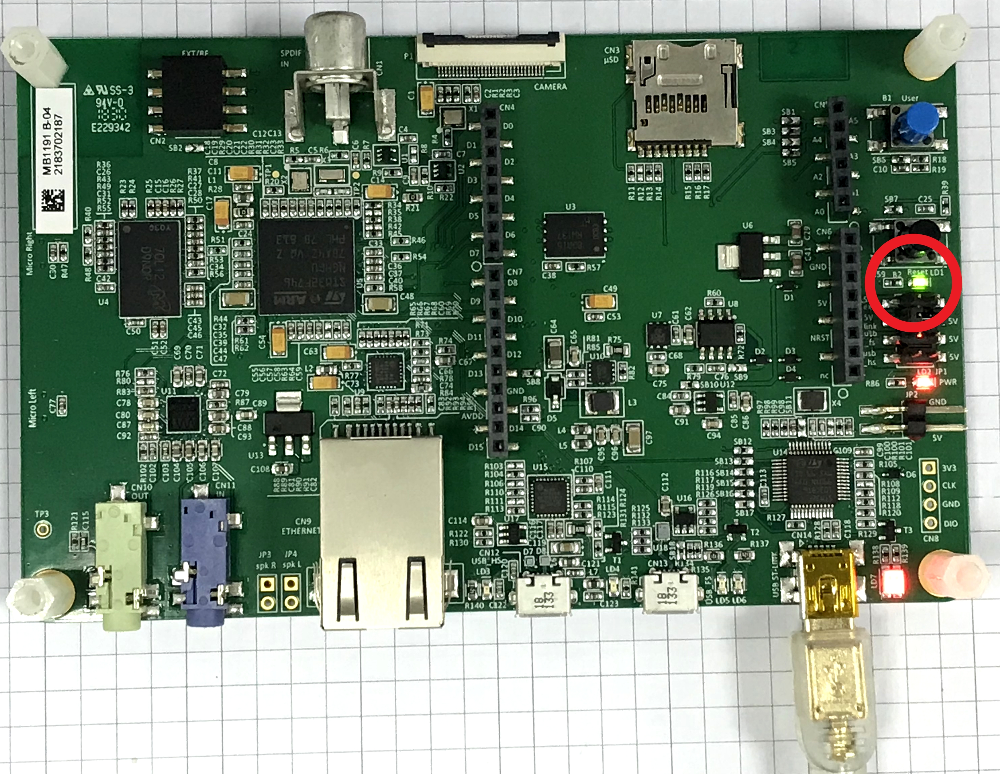

# Hands-on: UART_Receiving_Polling

主要流程：
1. 新增程式碼
2. 編譯專案
3. 執行專案

## 一、新增程式碼
1. 延續「03_UART_printf」的實作，開啟「Core\Src\main.c」檔：  
   
2. 在main.c的USER CODE Block PV當中新增如下程式碼：
   ```c
   /* USER CODE BEGIN PV */
   uint8_t uart1_rx_buffer[10];
   /* USER CODE END PV */
   ```
3. 在main.c的USER CODE Block 2當中新增如下程式碼：
   ```c
     /* USER CODE BEGIN 2 */
     HAL_UART_Receive(&huart1, uart1_rx_buffer, 10, 0xFFFF);
     /* USER CODE END 2 */
   ```
4. 新增完後存檔。

## 二、編譯專案
1. 點選專案圖示後按下滑鼠右鍵以開啟選單，並選取「Build Project」以進行編譯：  
   
2. 編譯完成之後在「Console」檢查編譯訊息以確認編譯是否成功：  
     

## 三、執行專案
1. 點選「Debug」鈕旁邊的下拉圖示開啟選單，並在選單中選取「F746-DISCO-UART Debug」以開啟除錯功能：  
   
4. 除錯功能順利啟動之後，可看到程式停在預設的中斷點，即main函式的第一行。此時按下「Resume」之後程式便開啟執行：  
   
5. 開始執行時可以看到LD1沒有閃滅，此時在終端機畫面輸入十個字元之後便開始執行while(1)當中的每500ms輸出PI1狀態的訊息：  
   
   
   NOTE1: 輸出PI1狀態訊息的同時可看到LD1每隔500 ms會閃滅一次：  
   
   
   NOTE2: 為讓終端機能顯示輸入的字元，請確認終端機軟體（如TeraTerm）的「Local echo」有啟用：  
   