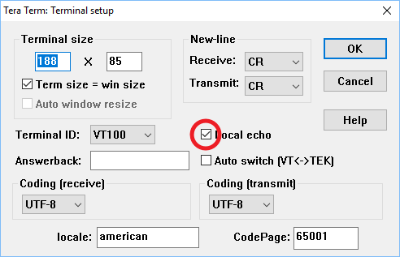

# Hands-on: UART_Receiving_DMA

主要流程：
1. 開啟UART DMA
2. 修改程式碼
3. 編譯專案
4. 執行專案

## 一、開啟UART DMA
1. 延續「05_UART_Receiving_IT」的實作，在IOC Editor左側的「Connectivity」展開項目中點選「USART1」，接著在中間下方的「Configuration」設定畫面點選「DMA Settings」分頁，並點選「Add」鈕開啟DMA設定，並在「DMA Request」下拉選單中選取「USART_RX」：  
   
2. 接著在中間下方的「Configuration」設定畫面點選「NVIC Settings」分頁，將「USART1 global interrupt」的「Enabled」取消勾選：  
   
3. 在CubeIDE上方的選單當中點選「Project -> Generate Code」以產生程式碼和專案檔：  
   

## 二、修改程式碼
1. 開啟「Core\Src\main.c」檔：  
   
2. 將在main.c的USER CODE Block 2當中的程式碼修改如下：
   ```c
     /* USER CODE BEGIN 2 */
     HAL_UART_Receive_DMA(&huart1, uart1_rx_buffer, 10);
     /* USER CODE END 2 */
   ```
3. 在main.c的USER CODE Block 4當中新增HAL_UART_RxHalfCpltCallback()程式碼如下：
   ```c
   /* USER CODE BEGIN 4 */
   #ifdef __GNUC__
   #define PUTCHAR_PROTOTYPE int __io_putchar(int ch)
   #else
   #define PUTCHAR_PROTOTYPE int fputc(int ch, FILE *f)
   #endif /* __GNUC__ */
   PUTCHAR_PROTOTYPE
   {
     HAL_UART_Transmit(&huart1, (uint8_t *)&ch, 1, 0xFFFF);
     return ch;
   }
   
   void HAL_UART_RxCpltCallback(UART_HandleTypeDef *huart)
   {
     printf("Receiving Completed!\n\r");
   }
   
   void HAL_UART_RxHalfCpltCallback(UART_HandleTypeDef *huart)
   {
     printf("Received 5 characters...\n\r");
   }
   /* USER CODE END 4 */
   ```
4. 修改新增程式碼完成之後存檔。

## 三、編譯專案
1. 點選專案圖示後按下滑鼠右鍵以開啟選單，並選取「Build Project」以進行編譯：  
   
2. 編譯完成之後在「Console」檢查編譯訊息以確認編譯是否成功：  
     

## 四、執行專案
1. 點選「Debug」鈕旁邊的下拉圖示開啟選單，並在選單中選取「F746-DISCO-UART Debug」以開啟除錯功能：  
   
2. 除錯功能順利啟動之後，可看到程式停在預設的中斷點，即main函式的第一行。此時按下「Resume」之後程式便開啟執行：  
   
3. 開始執行即看到LD1每隔500 ms會閃滅一次，同時在終端機畫面也可看到每500ms輸出PI1狀態的訊息。此時在終端機中輸入字元，在輸入完第五個字元時會出現「Received 5 characters...」，接著在輸入完第十個字元時會出現「Receiving Completed!」訊息：  
   
   
   NOTE: 為讓終端機能顯示輸入的字元，請確認終端機軟體（如TeraTerm）的「Local echo」有啟用：  
   