# Hands-on: TIMER

主要流程：
1. 重新開始一個新專案
3. 設定腳位功能及週邊
4. 新增程式碼
5. 編譯專案
6. 執行專案
7. 使用除錯功能

## 一、重新開始一個新專案
1. 點選「Help -> Information Center」進入「Information Center」畫面：  
   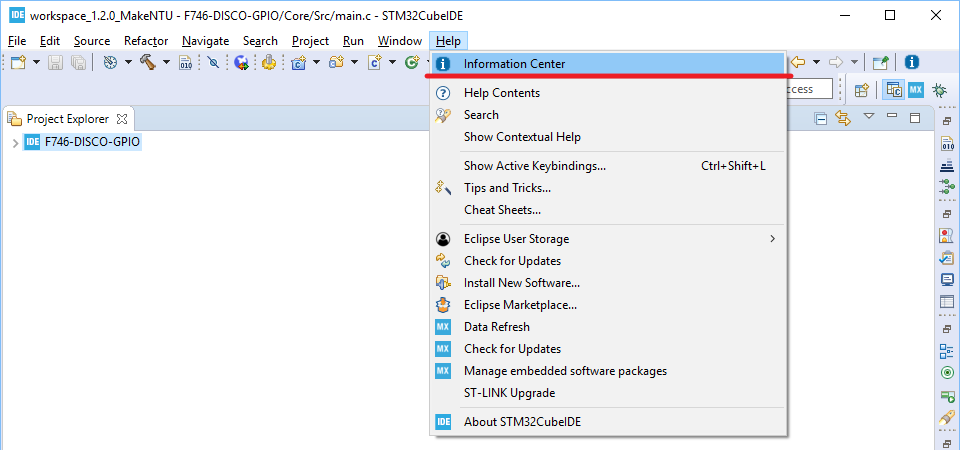  
2. 點選左側的「Start new STM32 project」按鈕：  
   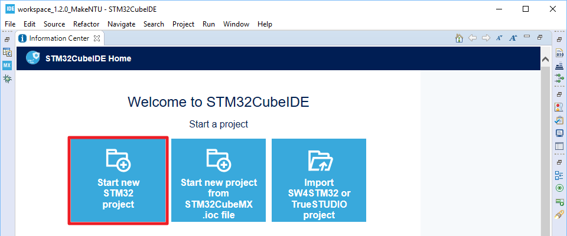  
3. 接著會出現初始化進度條的畫面。此步驟會花費一些時間請耐心等待：  
     
4. 接著出現如下的MCU選擇工具（Target Selection）。請點選中間的「Board Selector」分頁，並在「Part Number Search」當中輸入「32F746」，接著在畫面的右側篩選出了32F746GDISCOVERY開發板。點選畫面右側的32F746GDISCOVERY開發板，然後點選「Next >」按鈕：  
   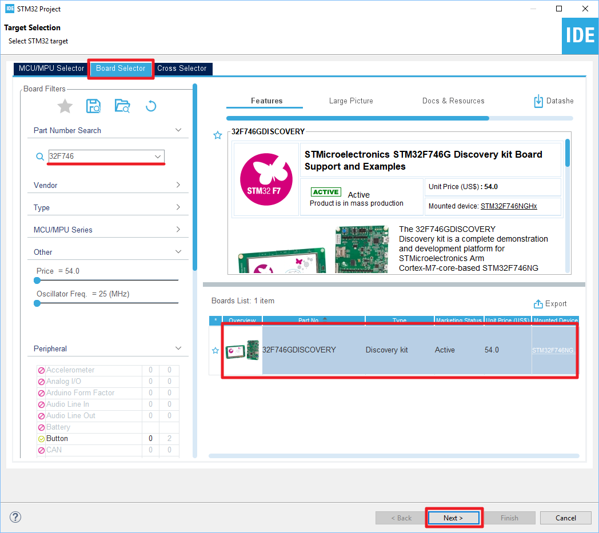  
5. 接著出現如下的專案設定畫面。在「Project Name」輸入專案名程，例如「F746-DISCO-UART」，並取消「Use default location」的選取狀態，然後在「Location」處輸入專案路徑，完成後點選「Finish」鈕：  
   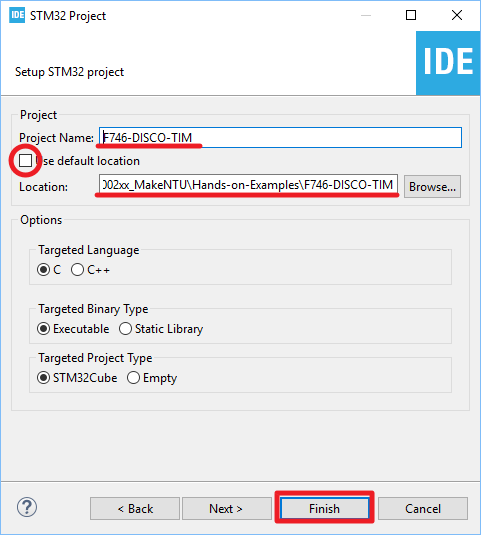  
   
   NOTE: 在「Location」處輸入的專案路徑不能有空格。
6. 出現如下的對話框時請選取「No」：  
    
   
    NOTE: 若此處選取「Yes」，則會開啟許多目前不會用到的Middleware造成專案處理上的複雜度。
7. 接著若出現如下的對話框，點選「Yes」並建議勾選「Remember my decision」，如此CubeIDE在後續的操作過程中就不會再次出現此對話框以節省操作時間：  
   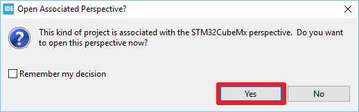 
8. 接著是工具的初始化進度條的畫面。同樣的，此步驟會花費一些時間請耐心等待：  
   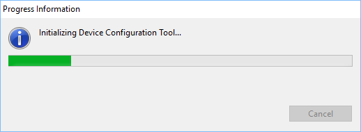 
9. 工具初始化結束之後是專案初始化，同樣的，此步驟會花費一些時間請耐心等待：  
   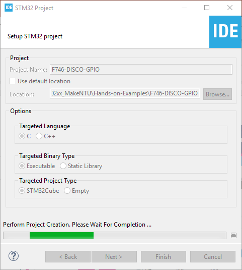 
10. 專案初始化結束之後會看到如下的畫面：  
    
    
    NOTE: 左側可看到專案目錄的目錄結構，右側可看到IOC Editor，可用來設定腳位及週邊控制器的操作參數。

##  二、設定腳位功能及週邊
1. 設定PI1為GPIO Output
   1. 在IOC Editor右下方的搜尋工具找尋PI1腳位：
      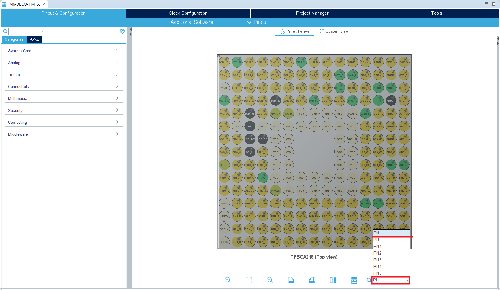
   2. 將PI1設定為GPIO_Output：
      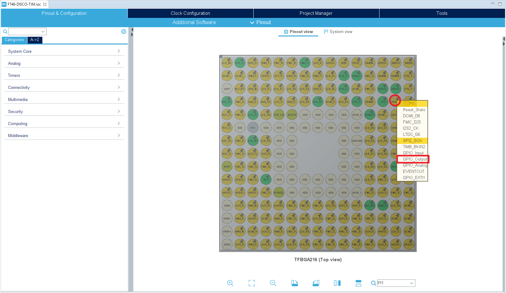
2. 設定TIMER
   1. 在IOC Editor的左側將「Timers」展開，並點選「TIM6」。接著在中間的「Mode」設定畫面勾選「Activated」之後會出現下方的「Configuration」設定畫面。點選「Parameter Settings」分頁，並作如下設定：
      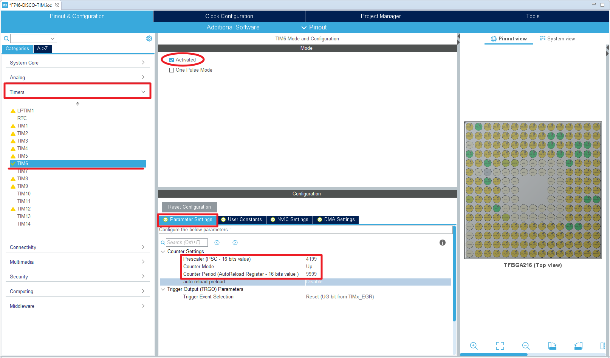
      - Prescaler (PSC - 16 bits value) = 4199
      - Counter Period (AutoReload Register - 16 bits value) = 9999
   2. 同樣在「Configuration」設定畫面點選「NVIC Settings」分頁，勾選「TIM6 global interrupt...」的「Enabled」：
      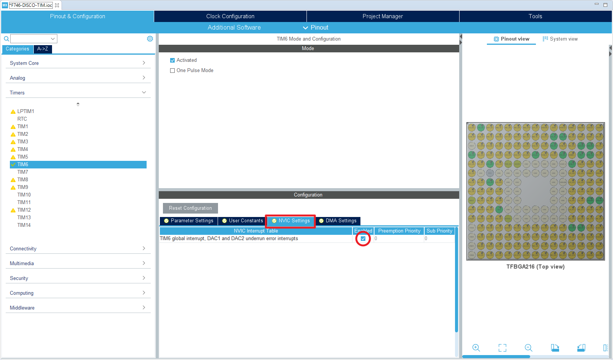
3. 設定完成之後點選「Project -> Generate Code」以產生程式碼和專案檔：
   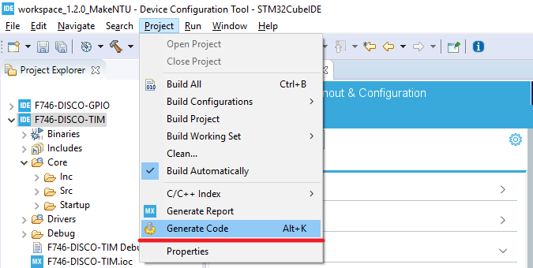

## 三、新增程式碼
1. 開啟「Core\Src\main.c」檔：  
   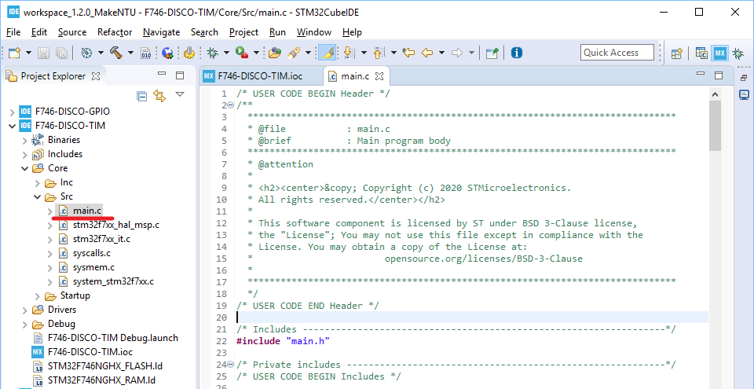
2. 在main.c的USER CODE Block 2當中新增如下程式碼：   
   ```c
     /* USER CODE BEGIN 2 */
     HAL_TIM_Base_Start_IT(&htim6);
     /* USER CODE END 2 */
   ```
4. 在main.c的USER CODE Block 4當中新增如下程式碼：  
   ```c
   /* USER CODE BEGIN 4 */
   void HAL_TIM_PeriodElapsedCallback(TIM_HandleTypeDef*htim)
   {
     HAL_GPIO_TogglePin(GPIOI, GPIO_PIN_1);
   }
   /* USER CODE END 4 */
   ```
5. 新增完後存檔。

## 四、編譯專案
1. 點選專案圖示後按下滑鼠右鍵以開啟選單，並選取「Build Project」以進行編譯：  
   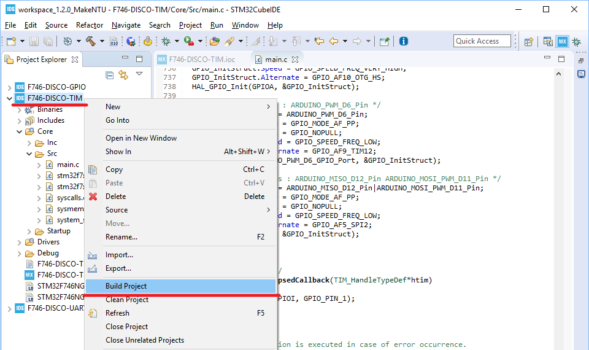
2. 編譯完成之後在「Console」檢查編譯訊息以確認編譯是否成功：  
   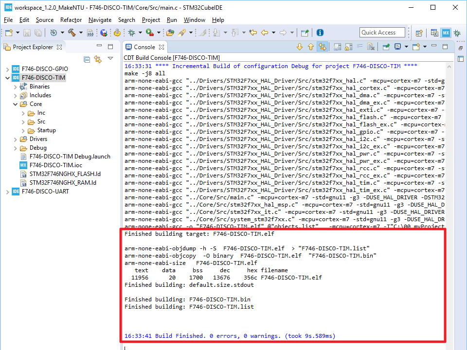  

## 五、執行專案
1. 點選專案圖示後按下滑鼠右鍵以開啟選單，並選取「Debug As --> 2 STM32 MCU C/C++ Application」以開啟除錯功能的設定：  
   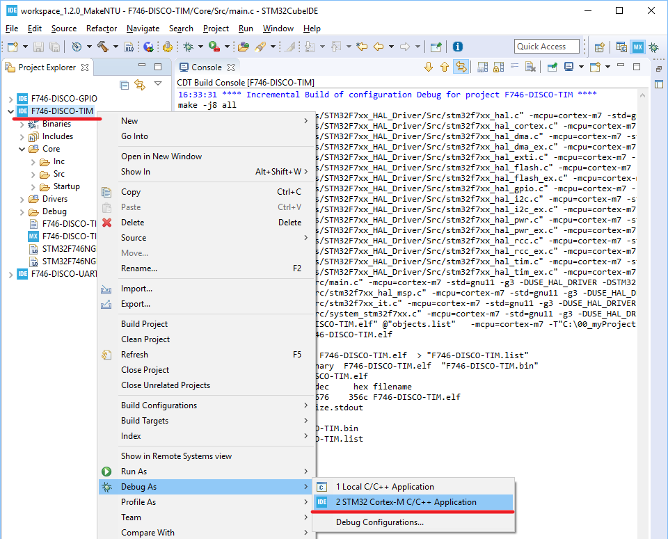
2. 除錯功能的設定畫面如下，確認「C/C++ Application」當中有指定ELF執行檔無誤後，點選「OK」按鈕以開啟除錯功能：  
   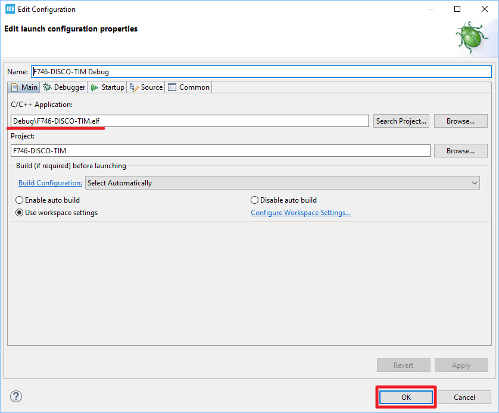
3. 開啟除錯功能的過程中若出現以下的對話框時請點選「Switch」，並建議勾選「Remember my decision」，如此CubeIDE在後續的操作過程中就不會再次出現此對話框以節省操作時間：  
   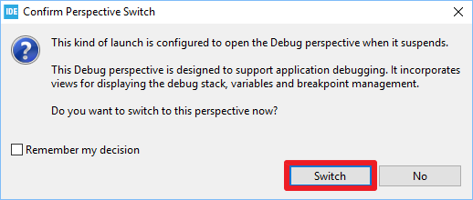
4. 除錯功能順利啟動之後，可看到程式停在預設的中斷點，即main函式的第一行。此時按下「Resume」之後程式便開啟執行：  
   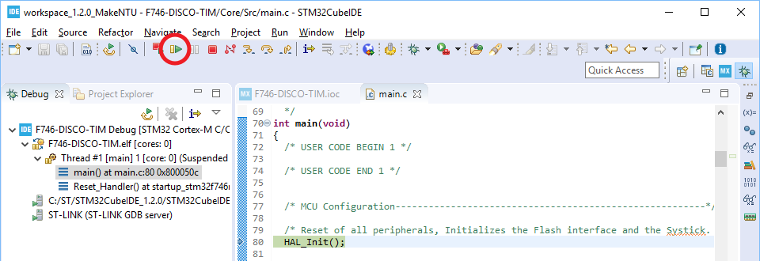
5. 執行時可看到LD1每隔500 ms會閃滅一次：  
   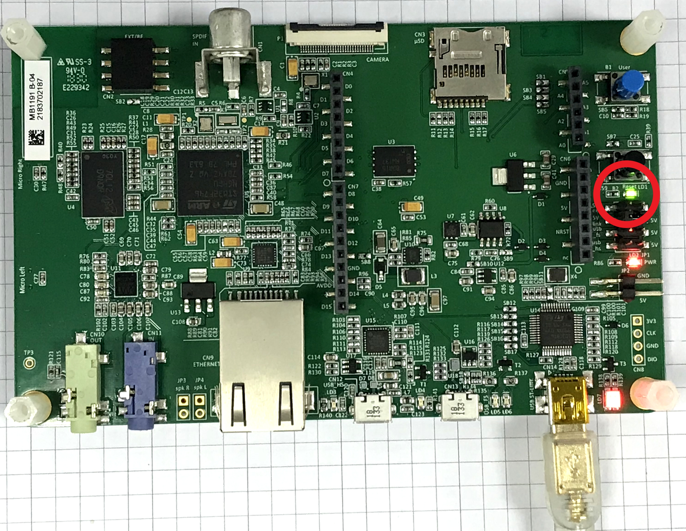