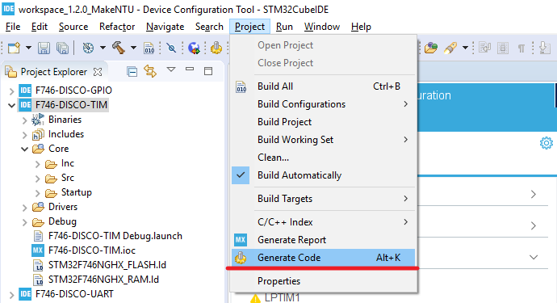
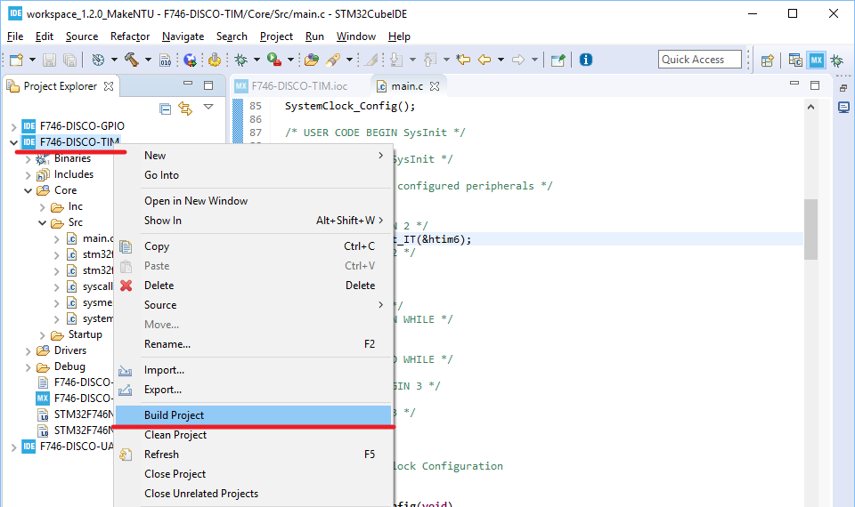

# Hands-on: TIMER-PWM

主要流程：
1. 設定腳位功能及週邊
2. 新增程式碼
3. 編譯專案
4. 執行專案

##  一、設定腳位功能及週邊
1. 將PI1設為INPUT
   1. 在IOC Editor右下角的搜尋欄位中輸入「PI1」以搜尋PI1腳位位置：  
      
   2. 將PI1設定為「GPIO_Input」：  
      
2. 關閉TIMER6
   延續「07_TIMER」的實作，在IOC Editor左側的「Timers」展開項目中點選「TIM6」，並在中間上方的「Mode」設定畫面中將「Activated」取消選取：  
   
3. 設定TIMER4
   1. 在IOC Editor右下角的搜尋欄位中輸入「PB8」以搜尋PB8腳位位置：  
      
   2. 將PI1設定為「TIM4_CH3」：  
      
   3. 點選IOC Editor左側「Timers」展開項目的「TIM4」，在中間上方的「Mode」設定畫面中將「Channel3」設為「PWM Generation CH3」，並點選下方「Configuration」設定畫面中的「Parameter Settings」分頁作如下的設定：  
      
4. 設定完成之後點選「Project -> Generate Code」以產生程式碼和專案檔：  
   

## 二、新增程式碼
1. 開啟「Core\Src\main.c」檔：  
   
2. 在main.c的USER CODE Block 2當中修改程式碼如下：   
   ```c
     /* USER CODE BEGIN 2 */
     HAL_TIM_PWM_Start(&htim4, TIM_CHANNEL_3);
     /* USER CODE END 2 */
   ```
3. 新增完後存檔。

## 三、編譯專案
1. 點選專案圖示後按下滑鼠右鍵以開啟選單，並選取「Build Project」以進行編譯：  
   
2. 編譯完成之後在「Console」檢查編譯訊息以確認編譯是否成功：  
     

## 四、執行專案
1. 點選「Debug」鈕旁邊的下拉圖示開啟選單，並在選單中選取「F746-DISCO-TIM Debug」以開啟除錯功能：  
   
   
2. 除錯功能順利啟動之後，可看到程式停在預設的中斷點，即main函式的第一行。此時按下「Resume」之後程式便開啟執行：  
   
   
5. 執行時可看到LD1每隔500 ms會閃滅一次：  
   
   
   NOTE: 32F746DISCOVERY開發板的LD1與PI1連接，但本實作LD1的驅動由原本的「PI1」改為「PB8」，因此需要用跳線連接PI1和PB8（圖中所示的黃色跳線）才能看到LD1的閃滅。