# 將TouchGFX的圖檔物件置於QSPI-FLASH

在TouchGFX專案當中使用了較多或是較大的圖檔情況下會耗用更多的記憶體（指STM32的內部FLASH），若超出內部FLASH的上限（1Mbyte）在編譯的連結階段會出現錯誤警示。此時的解決方式之一是將TouchGFX的圖檔物件置於開發板上的外部QSPI FLASH（16Mbyte）。

雖然在前一個TouchGFX專案當中並沒有發生記憶體不足的問題，但本實作就接續前一個TouchGFX專案來展示如何將TouchGFX圖檔物件置於QSPI FLASH的過程。


##  流程說明

1. 觀察編譯記憶體使用狀況
   - 開啟Build Analyzer
   - 觀察Memory Regions
   - 觀察Memory Details
2. 修改Lnker Script
   - 開啟Lnker Script
   - 在MEMORY指令當中新增QSPI記憶體區塊的定義
   - 在SECTIOS指令當中新增QSPI相關的定義
3. 修改程式碼以新增QSPI功能
   - 開啟main.c
   - 新增程式碼
4. 調整程式檔的編譯排除設定
5. 重新編譯專案
6. 觀察編譯之後新的記憶體使用狀況
7. 燒錄並執行
   - 在Debugger設定當中啟用External Loader
   - 燒錄執行


## 一、觀察編譯記憶體使用狀況

1. 開啟Build Analyzer
   點選「Window -> Show View -> Build Analyzer」以開啟「Build Analyzer」：  
   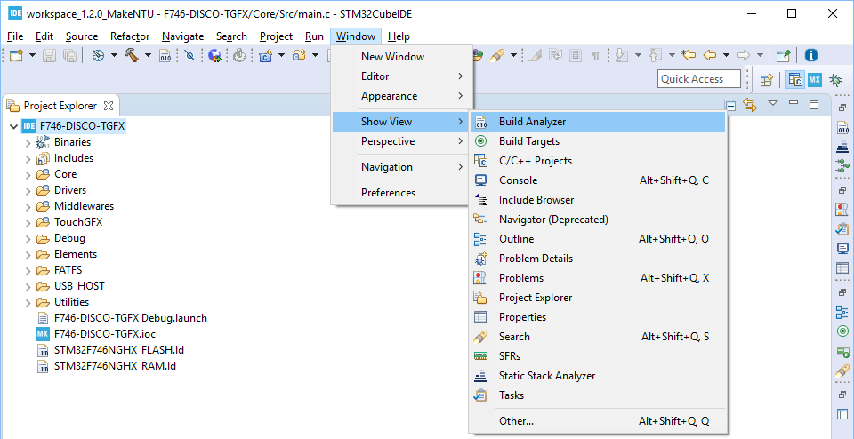
   
   
   
2. 觀察Memory Regions
   點選「Build Analyzer」當中的「Memory Regions」可看到記憶體用量：  
   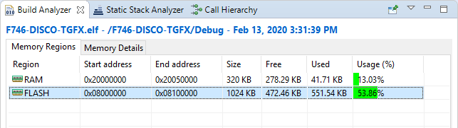

   

3. 觀察Memory Details
   點選「Build Analyzer」當中的「Memory Details」分頁可看到記憶體區塊當中所擺放的TouchGFX圖檔物件：  
   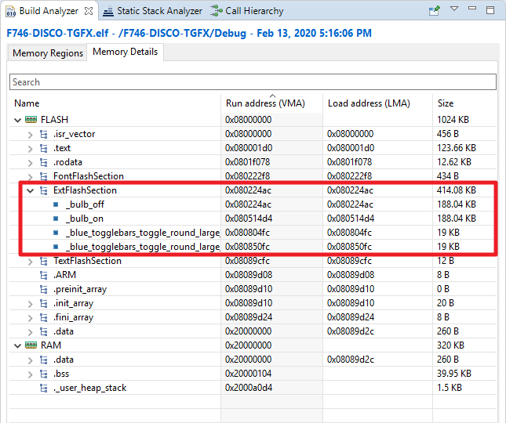


## 二、修改Linker Script

1. 開啟Linker Script 

   點選專案目錄之下的「STM32F746NGHX_FLASH.ld」檔案以開啟編輯：  
   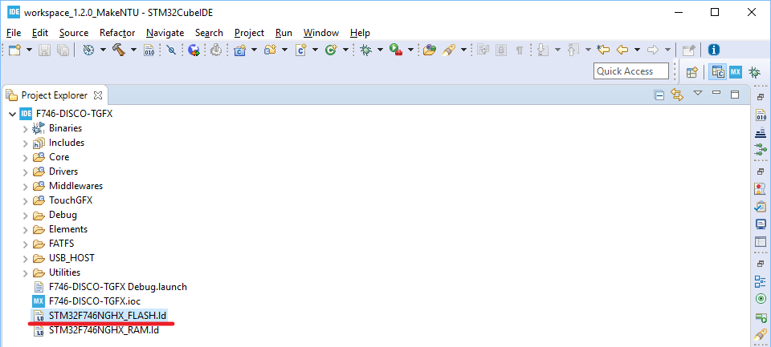

   

2. 在MEMORY{...} 當中的FLASH定義之後新增以下QSPI定義：

   ```
   QSPI   (rw)     : ORIGIN = 0x90000000, LENGTH = 16M 
   ```
   

   
3. 在SECTIOS{...} 當中的_user_heap_stack : {...} >RAM 之前新增以下定義：

   ```
    .tgfx : {*(ExtFlashSection)} >QSPI
   ```


4. 修改完成後結果如下：

   | Memory Region              |
   | -------------------------- |
   | 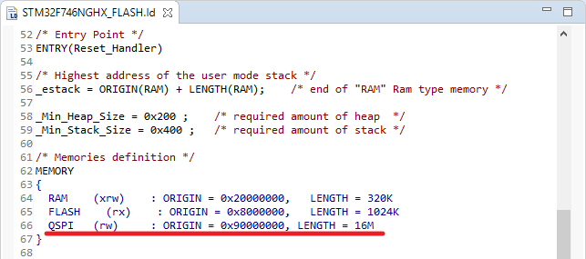 |

   | Section                    |
   | -------------------------- |
   | 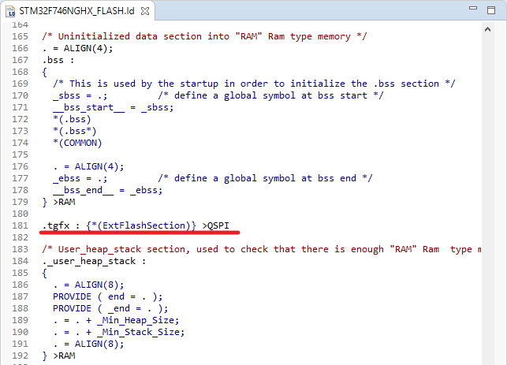 |

   

## 三、修改程式碼以新增QSPI功能

1. 開啟main.c
   點選專案目錄之下的Core\Src\main.c 以開啟編輯：  
   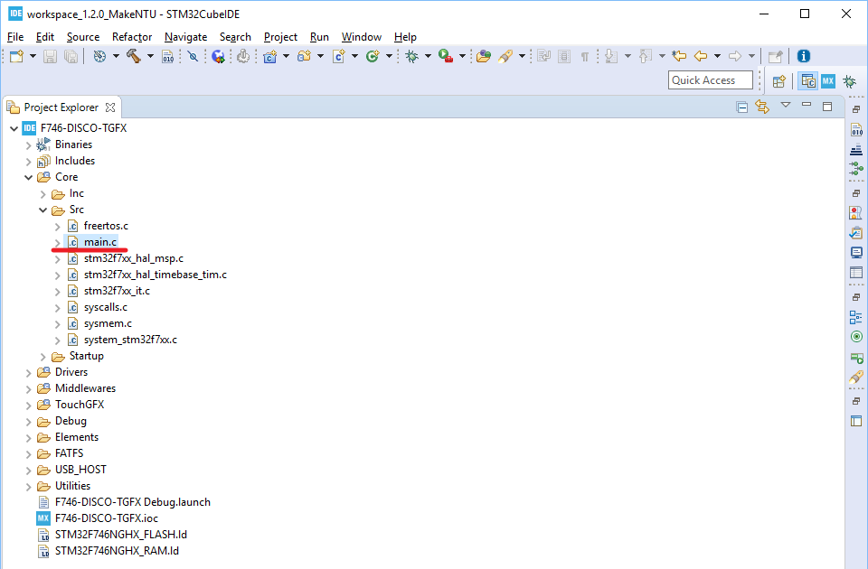

   
   
2. 在USER CODE Includes區塊當中加入如下的程式碼

   ```c
   /* USER CODE BEGIN Includes */
   #include "stm32746g_discovery_sdram.h"
   #include "stm32746g_discovery_qspi.h"
   /* USER CODE END Includes */
   ```

   

3. 在USER CODE 2區塊當中加入如下的程式碼：

   ```c
     /* USER CODE BEGIN 2 */
     BSP_SDRAM_Init();
     BSP_QSPI_Init();
     BSP_QSPI_EnableMemoryMappedMode();
     /* USER CODE END 2 */
   ```

   

## 四、調整程式檔的「編譯排除」設定

1. 將專案目錄的「Drivers\BSP\STM32746G-Discovery」展開：  
   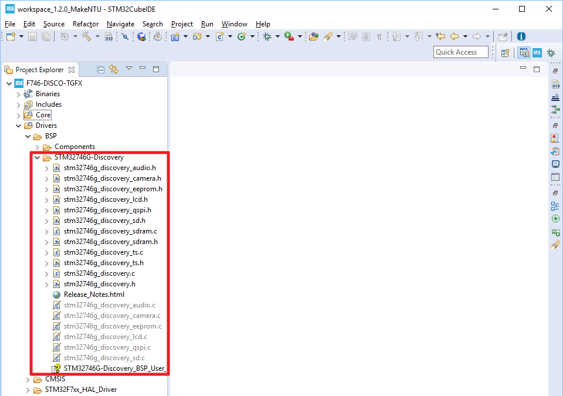

   

2. 點選「stm32746g_discovery_qspi.c」檔，並按下滑鼠右鍵以開啟選單，並選取「Resource Configurations -> Exclude from Build...」：  
   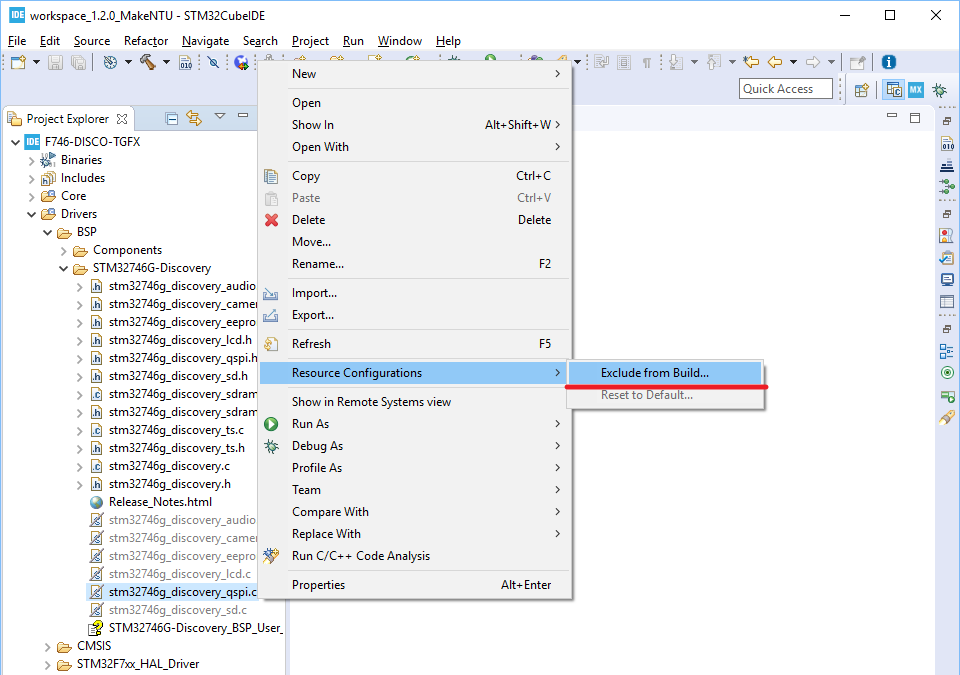

   

3. 點選「Deselect All」之後「Debug」和「Release」會取消選取狀態，接著按「OK」鈕結束設定：  
   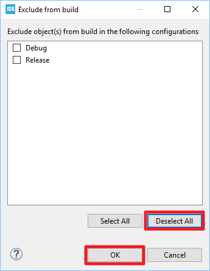

   

4. 完成之後可看到「stm32746g_discovery_qspi.c」已變為編譯成員：  
   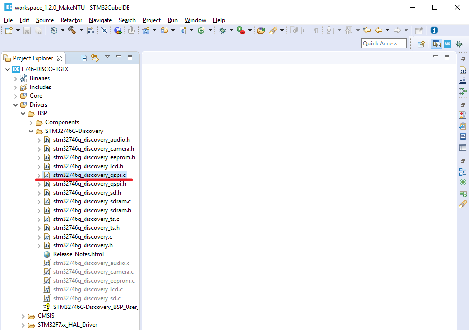


## 五、重新編譯專案並觀察新的記憶體使用狀況

1. 點選專案圖示之後按滑鼠右鍵開啟選單，並點選「Properties」以開啟設定項目：  
   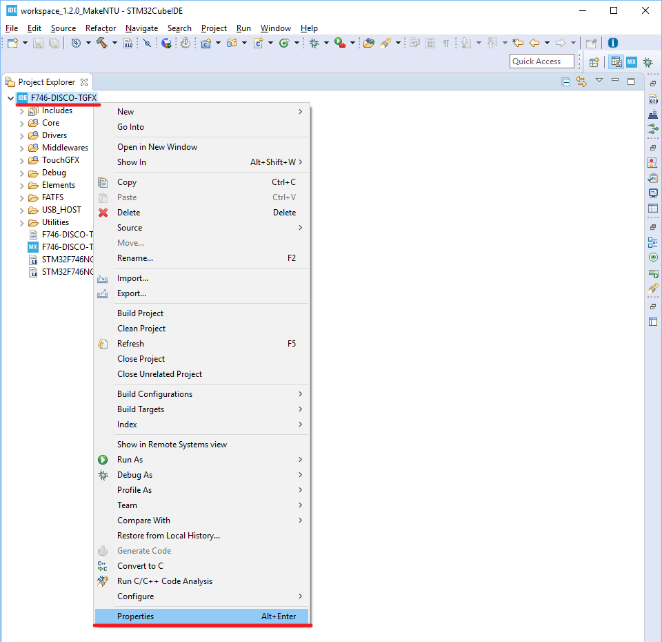

   

2. 在畫面左側將「C/C++ Build」展開並點選「Settings」，接著在設定畫面的右側選取
   「Tool Settings」分頁，然後選取「MCU Post build outputs」，接著將「Convert to binary file (-O binary)」選項取消勾選，完成後點選「Apply and Close」鈕結束設定：  
   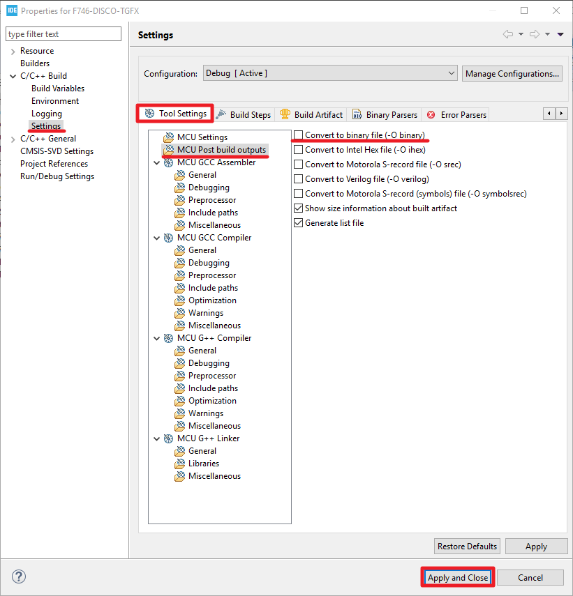

   NOTE: 使用QSPI記憶體區塊的情況之若不取消「Convert to binary file (-O binary)」，在專案編譯的最後產生BIN檔的過程會花費很多時間。為節省時間因此將這非必要的步驟取消。

   

3. 點選專案圖示之後按滑鼠右鍵開啟選單，並點選「Build Project」以進行專案編譯：  
   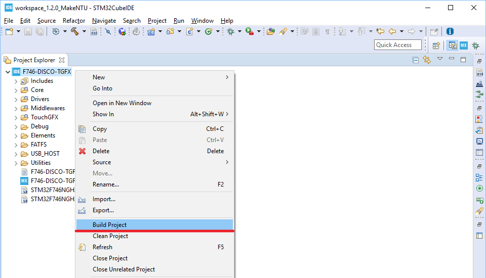

   

4. 編譯完成之後，點選「Window -> Show View -> Build Analyzer」來開啟「Build Analyzer」以觀察記憶體使用狀況：  
   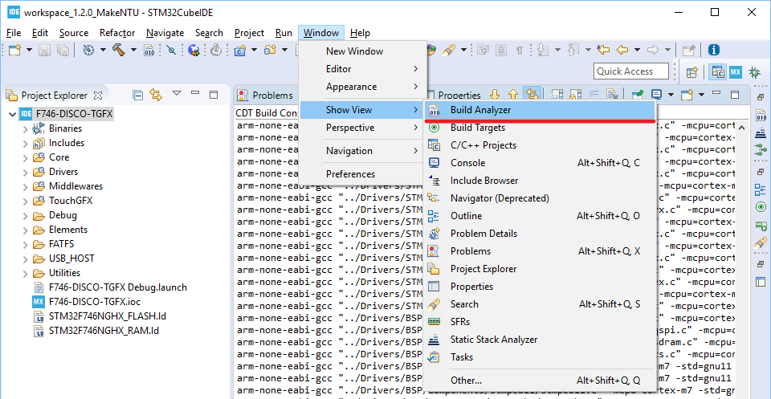

   

   NOTE: 觀察修改前及修改後的差異

   | 「Memory Regions」修改前 | 「Memory Regions」修改後   |
   | ------------------------ | -------------------------- |
   |   | 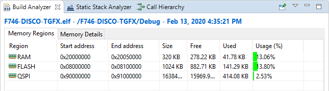 |
   - 將TouchGFX圖形字型物件擺放至QSPI之後，FLASH用量由53.86%降至13.80%。而TouchGFX圖形物件也僅佔QSPI-FLASH的2.53%。

     | 「Memory Details」修改前 | 「Memory Details」修改後   |
     | ------------------------ | -------------------------- |
     |   | 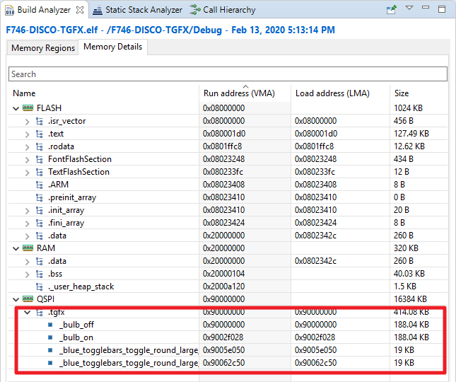 |
     
   - TouchGFX圖形物件原本置於FLASH之下（在ExtFlashSection內），修改後被置於QSPI當中。
   
   

## 六、燒錄並執行
1. 在Debugger設定當中啟用External Loader

   1. 點選「Debug」圖示旁的下拉圖示以開啟Debugger設定畫面：  
      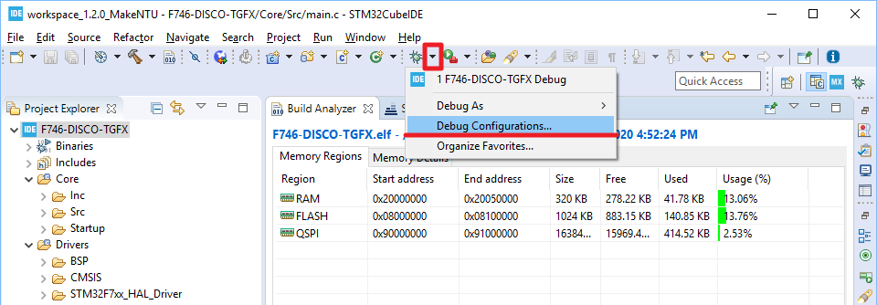

      

   2. 在右側的設定畫面中選取「Debugger」分頁，並勾選「External Loader」，接著按「Scan」鈕之後可得到External Loader列表，在列表中選取「N25Q128A_STM32F746G-DISCO, 0x90000000, NOR_FLASH, N25Q128A_STM32F746G-DISCO.stldr」，選取完之後直接點選「Debug」鈕以開啟燒錄程序：  
      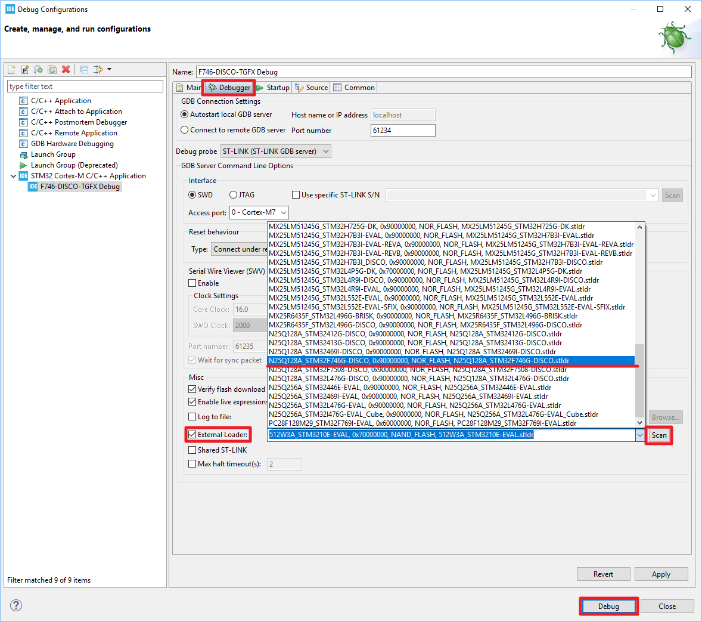

   

2. 執行
   因為要將資料燒錄到QSPI-FLASH當中所以會需要比較多的時間，因此請耐心等待，務必等到可以看到除錯器停在main中斷點之後才可按「RESUME」鈕開始執行：  
   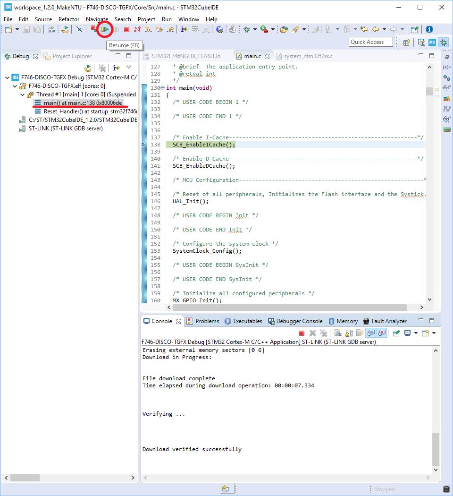
