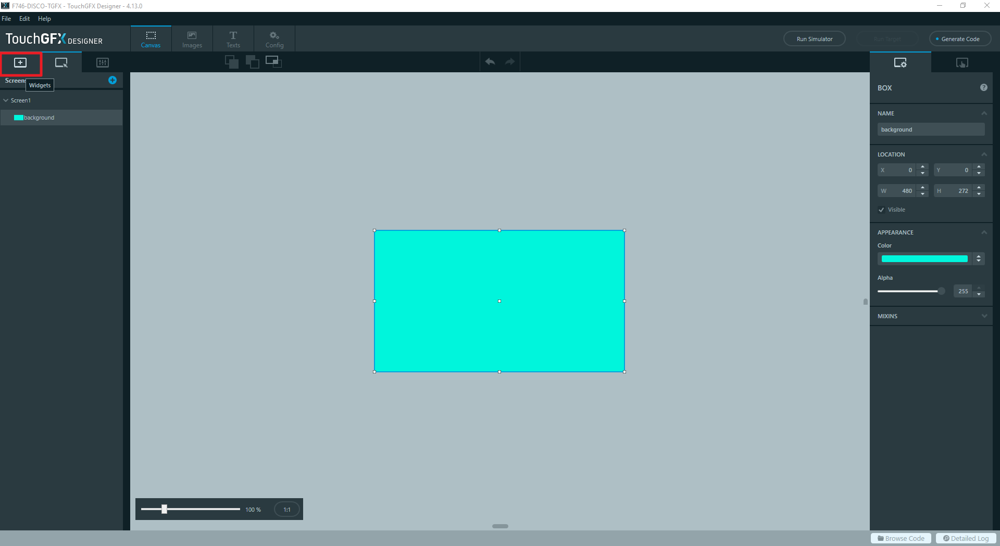
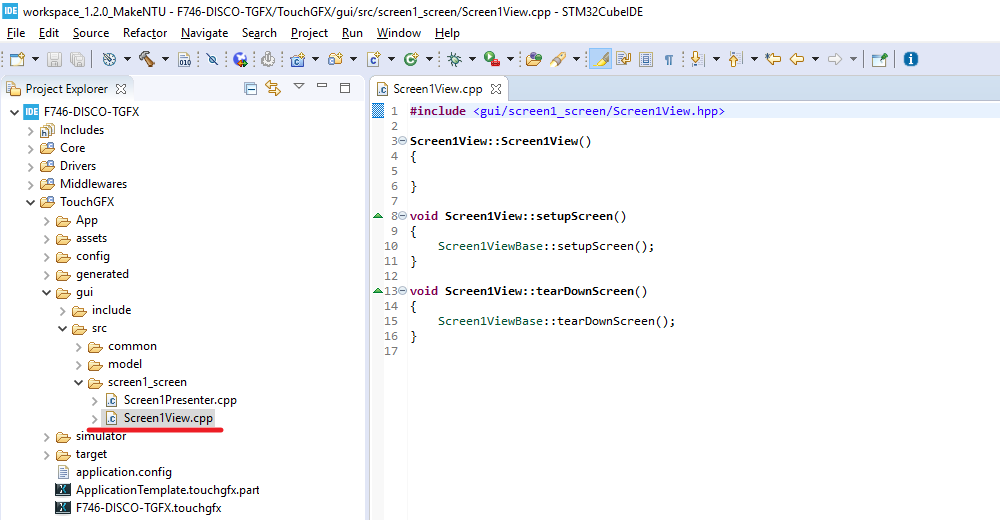

# 在STM32CubeIDE開始TouchGFX專案

實作目的：在STM32CubeIDE之下用最少的程序及加最少的程式碼產生一個TouchGFX專案以實作一個簡單的互動式GUI。


##  流程說明

1. 在STM32CubeIDE當中設定週邊並產生TouchGFX專案：
   - 新增專案
   - 開啟TouchGFX Plugin
   - 設定System Core
   - 關閉ETH
   - 關閉USB_OTG_FS
   - 調整LTDC設定
   - 關閉FATFS
   - 調整FreeRTOS設定
   - 設定TouchGFX Plugin
   - 產生程式碼及專案檔
2. 使用TouchGFX Designer設計GUI
   - 開啟TouchGFX Designer
   - 新增專案所需圖片
   - 使用Box元件當作畫面背景
   - 新增Image元件
   - 新增Toggle Button元件
   - 對Toggle Button新增Interaction
   - 產生TouchGFX程式碼
3. 修改TouchGFX程式碼，並用TouchGFX Designer模擬器驗證互動行為
   - 修改TouchGFX程式碼
     1. 修改Screen1Presenter.hpp
     2. 修改Screen1Presenter.cpp
     3. 修改Screen1View.hpp
     4. 修改Screen1View.cpp
   - 使用TouchGFX Designer模擬器驗證互動行為
4. 在STM32CubeIDE當中新增BSP以使用觸控功能
   - 在專案目錄下新增BSP目錄及所需檔案
   - 為BSP相關程式碼作編譯相關的設定
   - 修改程式碼以啟用觸控和顯示功能
5. 在STM32CubeIDE當中編譯並執行


## 一、在STM32CubeIDE當中設定週邊並產生TouchGFX專案

1. 新增專案

   - 在STM32CubeIDE當中由「Help --> Information Center」開啟Information Center:  
      
   
      
   
   - 點選最左側的「Start new STM32 project」鈕以開始建立專案：  
      
   
      
   
   - 選取「Board Selector」分頁，並在Part Number Search當中輸入「32F746」即可在右側的「Boards List」看到32F746GDISCOVERY開發板，在32F746GDISCOVERY上點滑鼠左鍵一次作選取，然後點選「Next >」鈕：  
      
   
      
   
   - 在「Project Name」欄位輸入專案名稱，如：F746-DISCO-TGFX，並取消「Use default location」的選取狀態，然後在「Location」處輸入專案路徑，同時請在「Targeted Language」選取「C++」。完成後點選「Finish」鈕：  
      
   NOTE: 專案路徑不能有空格符號！
   
      
   
   - 接著會出現如下的對話方塊，請務必選取「Yes」以簡化週邊設定的流程：  
      
   
      
   
   - 最後可得到如下畫面：  
      
   
   
   
2. 開啟TouchGFX Plugin

   - 點選「Additional Software」分頁以開啟「Additional Software Components selection」視窗：  
      
   
      
   
   - 將「STMicroelectronics.X-CUBE-TOUCHGFX」展開，再將「Graphics Application」展開，在「Application」選取「TouchGFX Generator」，完成後點選「Ok」鈕：  
      
   
      
   
   - 完成以上步驟之後會在左側看到新增的「Additional Software」, 展開後可看到「STMicroelectronics.X-CUBE-TOUCHGFX」：  
      
   
   
   
3. 設定System Core

   將「System Core」展開，並點選「CORTEX_M7」，並在中間「Configuration」設定畫面內的「CPU ICache」和「CPU DCache」設為「Enabled」：  
   

   

4. 關閉ETH

   將左側的「Connectivity」展開，並點選展開項目中的「ETH」，接著在中間的「Mode」設定畫面將「Mode」設為「Disable」：  
   

   

5. 關閉USB_OTG_FS

   在左側「Connectivity」的展開項目中點選「USB_OTG_FS」，接著在中間的「Mode」設定畫面將「Mode」設為「Disable」：  
   

   

6. 調整LTDC設定
    將左側的「Multimedia」展開，並點選展開項目中的「LTDC」，並在中間下方的「Configuration」設定畫面中點選「Layer Settings」分頁，接著作如下的調整：  
    
    
    - Layer 0 - Pixel Format = RGB888
    - Layer 0 - Blending Factor1 = Alpha constant
    - Layer 0 - Blending Factor2 = Alpha constant
    
    
    
7. 關閉FATFS

   - 將左側的「Middleware」展開，並點選展開項目中的「FATFS」，接著出現如下的畫面時點選「No」鈕：  
      
      
      
      
   - 接著在中間的「Mode」設定畫面將「SD Card」取消選取：  
      
      
      
      
   
8. 調整FreeRTOS設定

   - 在「Middleware」展開項目中點選「FREERTOS」，並在中間下方的「Configuration」設定畫面中點選「Tasks and Queues」分頁：  
      
   
      
   
   - 在「defaultTask」雙擊滑鼠左鍵以開啟Task設定畫面，並在Task設定畫面中將「Stack Size (Words)」改為「4096」，修改完之後點選「OK」鈕：  
      
   
      
   
9. 設定TouchGFX Plugin

   - 將左側的「Additional Software」展開後可看到「STMicroelectronics.X-CUBE-TOUCHGFX」，點選之後可得到中間的「Mode」設定畫面並點選「Graphics Application」：  
      
      
      
      
   - 接著在中間下方的「Configuration」設定畫面中點選「TouchGFX Generator」分頁並作如下設定：  
      

      - Interface = Parallel RGB (LTDC)
      - Framebuffer Pixel Format = RGB888
      - Width (LTDC) = 480 pixels
      - Height (LTDC) = 272 pixels
      - Framebuffer Strategy = Single Buffer
      - Buffer Location = By Address
      - Start Address = 0xC0000000
      - Application Tick Source = LTDC
      - Graphics Accelerator = ChromART (DMA2D)
      - Real-Time Operating System = CMSIS_RTOS_V1

         

9. 產生程式碼及專案檔

      - 點選「Project -> Generate Code」以產生程式碼和專案檔：  
          

        ​    

      - 完成之後會得到新增的「TouchGFX」目錄：  
        


## 二、使用TouchGFX Designer設計GUI

1. 開啟TouchGFX Designer
   
   1. 在「ApplicationTemplate.touchgfx.part」雙擊滑鼠左鍵以開啟TouchGFX Designer：  
      
   
   
   
   2. TouchGFX Designer開啟之後，選取「Blank UI」並點選「SELECT」鈕：   
      
      
      NOTE: 完成之後得到如下畫面：  
      
   

  

2. 新增專案所需圖片

   1. 在TouchGFX Designer畫面上方點選「Images」鈕以切換至Images分頁：  
      
   
      
   
   2. 點選「+」加號鈕以加入圖片（範例僅需加入如下的二張圖片）：  
      
      註：本範例所使用的二張圖片置於「[09_TouchGFX/Elements](https://github.com/ethanhuanginst/2020MakeNTUxST/tree/master/09_TouchGFX/Elements)」錄目當中。
   
      
   
   3. 完成之後可看到在「Image」分頁之下新增了二張圖片：  
      
   
   
   
4. 使用Box元件當作畫面背景

   1. 點選TouchGFX Designer畫面上方的「Canvas」鈕以切換至Canvas分頁：  
      

      
   
   2. 在TouchGFX Designer畫面左側點選SHAPES --> Box，接著會在畫布左上角出現Box元件：  
      

      
   
   3. 接著在畫面右側對Box元件作如下的設定：  
      
   
      - NAME = background
      - W = 480
      - H = 272
      - Color = 任何適合的顏色（建議選取綠、藍色調）
   
   
   
5. 新增Image元件

   1. 在TouchGFX Designer畫面左側點選「Widgets」鈕回到Widgets分頁：  
      
   
      
   
   2. 在TouchGFX Designer畫面左側的Widgets分頁點選IMAGES --> Image，接著會在畫布左上角出現Image元件：  
      
   
      
   
   3. 接著在畫面右側將NAME設為「bulb」：  
      
   
      
   
   4. 在畫面右側點選「IMAGE」設定需載入的圖片（bulb_off.png)：  
      
   
      
   
   5. 圖片載入的設定完成之後可得到如下的畫面：  
      
   
      
   
   6. 再於畫面右側針對Image元件的位置作設定：  
      
   
      - X = 134

   

5. 新增Toggle Button元件

   1. 在TouchGFX Designer畫面左側的Widgets分頁點選BUTTONS --> Toggle Button，接著會在畫布左上角出現Toggle Button元件：  
      
      
      
      
   2. 在畫面右側對Toggle Button元件作如下的設定：  
      

      - NAME = power_button
      - X = 176
      - Y = 234

   

6. 對Toggle Button新增Interaction

   1. 在TouchGFX Designer畫面右側的TOGGLE BUTTON設定畫面中點選「INTERACTIONS」鈕以切換至INTERACTIONS分頁， 並點選「Add Interaction」藍色按鈕以開啟設定畫面：   
      
      
      
      
   3. 透過右側的設定畫面作如下的設定：  
      

      - Trigger = Button is clicked
      
      - Choose clicked source = power_button
      
      - Action = Execute C++ code
      
      - Code = presenter->toggleLight();
      
        NOTE: 請確認Code的部份最後的分號不能省略！
   
   
   
7. 產生TouchGFX程式碼

   按下畫面右上角的「Generate Code」按鈕：  
   NOTE: 在還沒有按下「Generate Code」按鈕之前，按鈕會有藍色圓點標示，表示TouchGFX Designer有設定變更需要重新產生程式碼。

   
   
2. 完成後得到的結果畫面：  
      

      NOTE: 正常情況之會有如下的結果：
   
      - 「Generate Code」按鈕藍色圓點標示消失
      - TouchGFX Designer左下角的狀態顯示：Generate Code | Done


## 三、修改TouchGFX程式碼，並用TouchGFX Designer模擬器驗證    

1. 修改TouchGFX程式碼
   
   1. 回到STM32CubeIDE當中點選專案圖示，按下滑鼠右鍵，並選取「Refresh」以更新專案目錄：  
      
   
      
   
   2. 修改Screen1Presenter.hpp
   
      - 開啟「TouchGFX/gui/include/gui/screen1_screen/Screen1Presenter.hpp」檔案：  
        
      
   
      
   - 在檔案第29行加入如下程式碼：
     
     ```c
        virtual void toggleLight();
     ```
        NOTE: 第28行是virtual ~Screen1Presenter() {};
     
        
     
   - 在檔案第33行加入如下程式碼：
     
     ```c
        bool lightState;
     ```
     
     NOTE: 第32行是Screen1Presenter();
     
     
     
   - 完成後存檔得到結果如下：  
        
   
   
   
   3. 修改Screen1Presenter.cpp
   
      - 開啟「TouchGFX/gui/src/gui/screen1_screen/Screen1Presenter.cpp」檔案：  
        
      
        
        
      - 在檔案第12行加入如下程式碼：
        ```c
        lightState = false;
        ```
   
      - 在檔案第20行加入如下程式碼
        ```c
        void Screen1Presenter::toggleLight()
        {
            if (lightState == false)
            {
              lightState = true;
              view.switchBulbOn();
            }
            else
            {
              lightState = false;
              view.switchBulbOff();
            }
        }
        ```
   
      - 完成後存檔得到結果如下：  
        
      
   4. 修改Screen1View.hpp
   
      - 開啟「TouchGFX/gui/include/gui/screen1_screen/Screen1View.hpp」檔案：  
        
      
        
        
      - 在檔案第14行插入底下二行程式碼：
      
        ```c
         void switchBulbOn();
         void switchBulbOff();
        ```
   
      - 完成後存檔得到結果如下：  
         
   
   
   
   5. 修改Screen1View.cpp
   
      - 開啟「TouchGFX/gui/src/gui/screen1_screen/Screen1View.cpp」檔案：  
        
   
        
   
      - 在檔案第2行加入如下程式碼：
      
        ```c
        #include "BitmapDatabase.hpp"
        ```
      
      
      - 在檔案第18行加入如下程式碼：
      
        ```c
        void Screen1View::switchBulbOn()
        {
          bulb.setBitmap(Bitmap(BITMAP_BULB_ON_ID));
          bulb.invalidate();
        }
        
        void Screen1View::switchBulbOff()
        {
          bulb.setBitmap(Bitmap(BITMAP_BULB_OFF_ID));
          bulb.invalidate();
        }
        ```
        
      - 完成後存檔得到結果如下：  
        
   

   
2. 使用TouchGFX Designer模擬器驗證互動行為
   
   1. 回到TouchGFX Designer並按下「Run Simulator」鈕，接著會開始模擬器的編譯過程，若程式碼新增無誤的話可以得到如下的模擬器畫面：  
         
   
         
         
   2. 在模擬器之下點按「On-Off」鈕觀察互動結果是否如預期，預期的行為是燈泡明滅狀態是否會隨著點按「On-Off」鈕而改變，若符合預期的話模擬器的驗證即可完成。下一步就是回到STM32CubeIDE當中將在TouchGFX Designer當中設計完成的GUI連同STM32的程式碼編譯成STM32執行檔。
      
      |                       |                       |
      | --------------------- | --------------------- |
      |  |  |
   
      
      
   3. 關閉TouchGFX Designer。
   
   
   

## 四、在STM32CubeIDE當中新增BSP以啟用觸控功能

1. 在專案目錄下新增BSP目錄及所需檔案

   1. 開啟專案目錄
      1. 在STM32CubeIDE當中點選專案圖示並按下滑鼠右鍵開啟選單，並點選「Properties」以開啟設定畫面:  
         
         
         
         
      2. 在設定畫面的左側點選「Resource」之後，在設定畫面右側點選「Location」之後的「Show In System Explorer」鈕：  
         
      
         
      
      3. 接著會開啟專案目錄如下：  
          
      
          
      
      4. 在專案目錄「Drivers」之下新增「BSP」目錄：  
          
      
          
      
      5. 開啟STM32Cube_FW_F7_V1.15.0/Drivers/BSP目錄：  
          
      
          
      
      6. 將「STM32Cube_FW_F7_V1.15.0/Drivers/BSP」目錄當中的「Components」和「STM32746G-Discovery」二個目錄（下圖左方）複製到專案目錄「Drivers/BSP」目錄之下（下圖右方）：  
    
      
          
      
      7. 在專案目錄之下新增「Utilities」 目錄：  
          
      
          
      
      8. 將「STM32Cube_FW_F7_V1.15.0/Utilities」目錄當中的「Fonts」目錄（下圖左方）複製到專案目錄「Utilities」目錄當中（下圖右方）：  
          
      
        
      
      9. 回到STM32CubeIDE當中點選專案圖示並按下滑鼠右鍵開啟選單，並點選「Refresh」以更新STM32CubeIDE當中的專案目錄：  
          
      
          NOTE: 更新完之後可在STM32CubeIDE的專案目錄當中看到新增加的「Driver/BSP」和「Utilities/Fonts」目錄：  
          
      
   
   
   
2. 為BSP相關程式碼作編譯設定

   1. 在STM32CubeIDE當中將不必要的程式碼檔案排除在編譯成員之外

      - 將STM32CubeIDE當中的Drivers/BSP/STM32746G-Discovery目錄展開：  
        

        
        
      - 點選如下的「audio」、「camera」、「eeprom」、「lcd」、「qspi」和「sd」的c檔之後，按下滑鼠右鍵開啟選單，並選取「Resource Configurations --> Exclude from Build」：  
        
      
        
        
      - 點選設定畫面當中的「Select All」鈕之後可看到「Debug」和「Release」呈現選取狀態，然後點選「OK」鈕結束設定：  
               
      
           
           
      - 設定完成之後在STM32CubeIDE的專案目錄之下可看到剛剛選取的c檔已被排除：  
        
      
        NOTE: 目錄下的.h檔不需作排除的處理
        
        NOTE: 請確認「sdram」和「ts」這二個c檔沒有被排除，否則接下來編譯時會出現錯誤。
        
        - stm32746g_discovery_sdram.c：用來對SDRAM作初始化（TouchGFX會使用SDRAM作framebuffer）
        - stm32746g_discovery_ts.c：用來對觸控銀幕作初始化
   
   
   
   2. 在STM32CubeIDE當中設定「Include Path」編譯參數

      - 點選專案圖示並按下滑鼠右鍵開啟選單，並點選「Properties」以開啟設定項目：  
        
   
        
      
      - 在畫面左側將「C/C++ Build」展開並點選「Settings」，接著在設定畫面的右側選取「Tool Settings」分頁，然後選取「MCU GCC Compiler --> Include paths」，最後在「Include paths (-I)」設定畫面當中新增如下的路徑：  
        
      
        - ../Drivers/BSP/STM32746G-Discovery
      
        
      
      - 同樣在「Tool Settings」分頁的設定畫面當中選取「MCU G++ Compiler --> Include paths」，最後在「Include paths (-I)」設定畫面當中新增如下的路徑，並在設定完成之後點選「Apply and Close」關閉設定畫面  
        
      
        - ../Drivers/BSP/STM32746G-Discovery
   
    
   
3. 修改程式碼以啟用觸控和顯示功能
   
      1.   修改main.c檔案
      
            - 開啟「Core/Src/main.c」檔：  
              
      
            - 在USER CODE Includes區塊當中加入如下的程式碼：
      
              ```c
                   /* USER CODE BEGIN Includes */
                   #include "stm32746g_discovery_sdram.h"
                   /* USER CODE END Includes */
              ```
      
              
      
            - 在USER CODE 2區塊當中加入如下的程式碼：
      
              ```c
                     /* USER CODE BEGIN 2 */
                     BSP_SDRAM_Init();
                     /* USER CODE END 2 */
              ```
      
              
      
            - 在StartDefaultTask()當中的USER CODE 5區塊當中的for(;;)之前加入MX_TouchGFX_Process()，結果如下：
      
              ```c
                     /* USER CODE BEGIN 5 */
                     MX_TouchGFX_Process();
                     /* Infinite loop */
                     for(;;)
                     {
                       osDelay(1);
                     }
                     /* USER CODE END 5 */ 
              ```
      
              
      
      2.   修改STM32TouchController.cpp檔案
      
            - 開啟「TouchGFX/target/STM32TouchController.cpp」檔：  
              
      
            - 在第21行新增以下程式碼：
      
              ```c
              #include "stm32746g_discovery_ts.h"
              ```
      
            - 在第28行插入以下程式碼：
      
              ```c
              BSP_TS_Init(480, 272);
              ```
      
            - 在第43行插入以下程式碼：
      
              ```c
                TS_StateTypeDef state = { 0 };
                BSP_TS_GetState(&state);
                if (state.touchDetected)
                {
                  x = state.touchX[0];
                  y = state.touchY[0];
                    
                  return true;
                }
              ```
      
            - 完成後結果如下：  
                
      


## 五、在STM32CubeIDE當中編譯並執行

1. 編譯
   
   - 點選專案圖示之後按滑鼠右鍵開啟選單，並點選「Build Project」以進行專案編譯：  
     
     
     
     
   - 編譯完成之後結果如下：  
     
   
   
   
2. 燒錄並執行

   - 點選專案圖示之後按滑鼠右鍵開啟選單，並點選「Debug As -> 2 STM32 Cortex-M C/C++ Application」以開啟Debugger設定畫面：  
     

     
     
   - 在Debugger設定畫面當中直接點選「OK」鈕開啟燒錄：  
     

   

3. 點選「Resume (F8)」鈕開始執行：  
   
