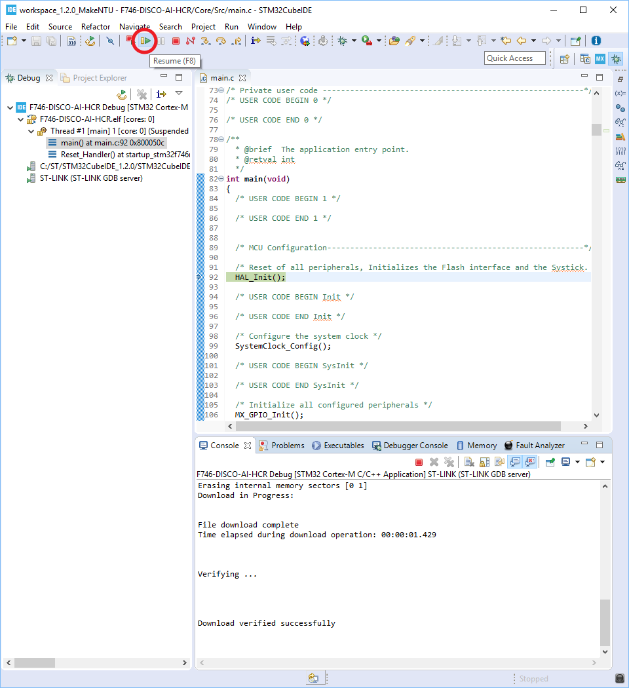
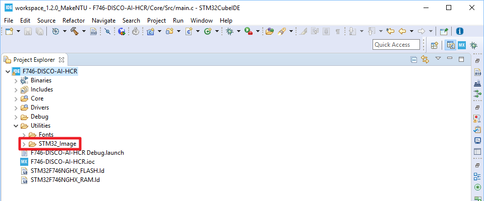
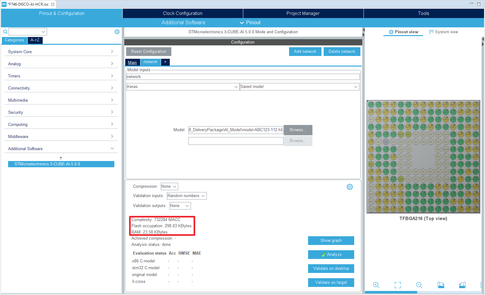
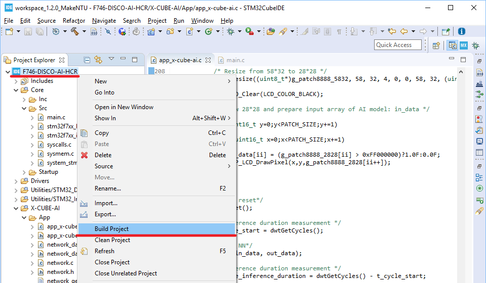

# 在STM32CubeIDE開始AI專案

實作目的：在STM32CubeIDE當中用最少的程序及加最少的程式碼產生一個使用外部的HCR模型的手寫辨識專案以展示AI專案的開發過程。

本實作分成三個階段，前面二個階段是基礎建設，最後第三階段加上AI模型。

- STAGE 1：在LCD上顯示「READY」  
  

- STAGE 2：手寫時顯示軌跡，最後作縮圖顯示

  | 手寫                      | 顯示縮圖                  |
  | ------------------------- | ------------------------- |
  |  |  |

- STAGE 3：將手寫軌跡作字元辨識並顯示辨識結果
  
  | 手寫                      | 顯示辨識結果            |
  | ------------------------- | ----------------------- |
  |  |  |
  
  

## 流程說明

- **STAGE 1: 在LCD上顯示「READY」**
   
   1. 新增專案
      1. 開始新專案
      2. 開啟X-CUBE-AI Plugin
      3. 開啟並設定FMC/SDRAM
      4. 開啟I2C3
      5. 開啟USART1
      6. 開啟DMA2D
      7. 開啟並設定LTDC
      8. 產生程式碼及專案檔
   2. 加入BSP
      1. 在專案目錄下新增BSP目錄及所需檔案
      2. 為BSP相關程式碼作編譯相關的設定
   3. 新增程式碼
4. 編譯並執行
   
   
   
- **STAGE 2：手寫時顯示軌跡，最後作縮圖顯示**
   
   1. 新增「Utilities/ST_Image」目錄及程式碼
   2. 編譯設定的調整
      1. 調整編譯排除的設定
      2. 加入編譯引用目錄
   3. 新增程式碼
4. 編譯並執行
   
   
   
- **STAGE 3：匯入AI模型後將手寫軌跡作字元辨識並顯示辨識結果**
   
   1. 使用X-CUBE-AI   
   2. 新增「Utilities/ST_DWT」目錄及程式碼
   3. 編譯設定的調整
      1. 調整編譯排除的設定
      2. 加入編譯引用目錄
   4. 新增程式碼
      1. main.c
      2. app_x-cube-ai.c
   5. 編譯並執行


## 詳細步驟

### STAGE 1: 在LCD上顯示「READY」 

1. 新增專案
   1. 開始新專案
   
      - 在STM32CubeIDE當中由「Help --> Information Center」開啟Information Center:  
        
   
        
   
      - 點選最左側的「Start new STM32 project」鈕以開始建立專案：  
        
   
        
   
      - 選取「Board Selector」分頁，並在Part Number Search當中輸入「32F746」即可在右側的「Boards List」看到32F746GDISCOVERY開發板，在32F746GDISCOVERY上點滑鼠左鍵一次作選取，然後點選「Next >」鈕：  
        
   
        
   
      - 在「Project Name」欄位輸入專案名稱，如：F746-DISCO-AI-HCR，並取消「Use default location」的選取狀態，然後在「Location」處輸入專案路徑，完成後點選「Finish」鈕：  
        
   
      - 接著會出現如下的對話方塊，請選取「No」：  
        
   
      - 最後可得到如下畫面：  
        
   
   2. 開啟X-CUBE-AI Plugin   
      - 點選「Additional Software」分頁以開啟「Additional Software Components selection」視窗：  
        
      - 將「STMicroelectronics.X-CUBE-AI」展開，再將「Artificial Intelligence X-CUBE-AI」展開後點選「Core」，接著將「Artificial Intelligence X-CUBE-AI」展開後選取「Application Template」，完成後點選「Ok」鈕：  
        
      - 完成以上步驟之後會在左側看到新增的「Additional Software」, 展開後可看到「STMicroelectronics.X-CUBE-TOUCHGFX」：  
        
   
   3. 開啟並設定FMC/SDRAM
      將左側的「Connectivity」展開，並點選展開項目中的「FMC」，接著在中間的「Mode」設定畫面將「SDRAM1」展開後作如下的設定：  
   
      
      - Clock and chip enable = SDCKE0+SDNE0
      - Internal bank number = 4 banks
      - Address = 12 bits
      - Data = 16 bits
      - Byte enable = 16-bit byte enable
      
   4. 開啟I2C3 
      同樣在「Connectivity」展開項目中點選「I2C3」，接著在中間的「Mode」設定畫面中將「I2C」設為「I2C」：  
   
      
   5. 開啟USART1
      同樣在「Connectivity」展開項目中點選「USART1」，接著在中間的「Mode」設定畫面中將「Mode」設為「Asynchronous」：  
   
      
   6. 開啟DMA2D
      將左側的「Multimedia」展開，並點選展開項目中的「DMA2D」，接著在中間的「Mode」設定畫面勾選「Activated」：  
   
      
   7. 開啟並設定LTDC
      同樣在「Multimedia」展開項目中點選「LTDC」，接著在中間的「Mode」設定畫面中將「Display Type」設為「RGB888 (24 bits)」：  
   
      
   8. 產生程式碼及專案檔
      點選「Project -> Generate Code」以產生程式碼和專案檔：  
      
   
2. 加入BSP
   1. 在專案目錄下新增BSP目錄及所需檔案
      
      1. 在STM32CubeIDE當中點選專案圖示並按下滑鼠右鍵開啟選單，並點選「Properties」以開啟設定畫面:  
         
      2. 在設定畫面的左側點選「Resource」之後，在設定畫面右側點選「Location」之後的「Show In System Explorer」鈕：  
         
      3. 接著會開啟專案目錄如下：  
         
      4. 在專案目錄「Drivers」之下新增「BSP」目錄：  
         
      5. 開啟STM32Cube_FW_F7_V1.15.0/Drivers/BSP目錄：  
         
      6. 將「STM32Cube_FW_F7_V1.15.0/Drivers/BSP」目錄當中的「Components」和「STM32746G-Discovery」二個目錄（下圖左方）複製到專案目錄「Drivers/BSP」目錄之下（下圖右方）：  
         
      7. 在專案目錄之下新增「Utilities」 目錄：  
         
      8. 將「STM32Cube_FW_F7_V1.15.0/Utilities」目錄當中的「Fonts」目錄（下圖左方）複製到專案目錄「Utilities」目錄當中（下圖右方）：  
         
      9. 回到STM32CubeIDE當中點選專案圖示並按下滑鼠右鍵開啟選單，並點選「Refresh」以更新STM32CubeIDE當中的專案目錄：  
            
         NOTE: 更新完之後可在STM32CubeIDE的專案目錄當中看到新增加的「Driver/BSP」和「Utilities/Fonts」目錄：  
         
      
   2. 為BSP相關程式碼作編譯相關的設定
      1. 調整BSP目錄下的編譯排除的設定
         
         1. 將STM32CubeIDE當中的Drivers/BSP/STM32746G-Discovery目錄展開，並點選如下的「audio」、「camera」、「eeprom」、「qspi」和「sd」的c檔之後，按下滑鼠右鍵開啟選單，並選取「Resource Configurations --> Exclude from Build」：  
            
            
         2. 點選設定畫面當中的「Select All」鈕之後可看到「Debug」和「Release」呈現選取狀態，然後點選「OK」鈕結束設定：  
            
            
         3. 設定完成之後在STM32CubeIDE的專案目錄之下可看到剛剛選取的c檔已被排除：  
            
            
            NOTE: 目錄下的.h檔不需作排除的處理
            
            NOTE: 請確認以下檔案沒有被排除：
            
            - 留下stm32746g_discovery_lcd.c
            - 留下stm32746g_discovery_sdram.c
            - 留下stm32746g_discoveryts.c
            - 留下stm32746g_discovery.c      
   2. 加入編譯引用目錄
      
         1. 點選專案圖示並按下滑鼠右鍵開啟選單，並點選「Properties」以開啟設定項目：  
      
      2. 在畫面左側將「C/C++ Build」展開並點選「Settings」，接著在設定畫面的右側選取「Tool Settings」分頁，然後選取「MCU GCC Compiler --> Include paths」，最後在「Include paths (-I)」設定畫面當中新增如下的路徑，完成後點選「Apply and Close」鈕關閉設定畫面：  
          
        - ../Drivers/BSP/STM32746G-Discovery
   
3. 新增程式碼

   1. 開啟「Core/Src/main.c」檔：  
   
      
   2. 在USER CODE Include區塊中新增以下程式碼：

      ```c
      /* USER CODE BEGIN Includes */
      #include "stm32746g_discovery_ts.h"
      #include "stm32746g_discovery_lcd.h"
      /* USER CODE END Includes */
      ```

   3. 在USER CODE PM區塊中新增以下程式碼

      ```c
      /* USER CODE BEGIN PM */
      #define SDRAM_DEVICE_ADDR  ((uint32_t)0xC0000000)
      #define LCD_FRAME_BUFFER   SDRAM_DEVICE_ADDR
      /* USER CODE END PM */
      ```

   4. 在USER CODE 2區塊中新增以下程式碼：

      ```c
        /* USER CODE BEGIN 2 */
        /* LCD + TS init*/
        BSP_LCD_Init();
        BSP_TS_Init(BSP_LCD_GetXSize(), BSP_LCD_GetYSize());
      
        /* Draw "READY" */
        BSP_LCD_LayerDefaultInit(LTDC_ACTIVE_LAYER, LCD_FRAME_BUFFER);
        BSP_LCD_SelectLayer(LTDC_ACTIVE_LAYER);
      
        BSP_LCD_Clear(LCD_COLOR_BLACK);
        BSP_LCD_SetTextColor(LCD_COLOR_WHITE);
        BSP_LCD_SetBackColor(LCD_COLOR_BLACK);
        BSP_LCD_SetFont(&Font24);
        BSP_LCD_DisplayStringAt(1,96,(uint8_t*)"READY",CENTER_MODE);
      #ifdef STAGE3
        /* DWT Initialization */
        dwtIpInit();
      #endif	//End of #ifdef STAGE3
        /* USER CODE END 2 */
      ```

4. 編譯並執行

   1. 點選專案圖示之後按滑鼠右鍵開啟選單，並點選「Build Project」以進行專案編譯：  
      
   2. 編譯完成之後結果如下：  
      
   3. 點選專案圖示之後按滑鼠右鍵開啟選單，並點選「Debug As -> 2 STM32 Cortex-M C/C++ Application」以開啟Debugger設定畫面：  
      
   4. 在Debugger設定畫面當中直接點選「OK」鈕開啟燒錄：  
      
   5. 點選「Resume (F8)」鈕開始執行：  
      
   6. 執行結果如下：  
      

### STAGE 2: 手寫時顯示軌跡，最後作縮圖顯示

1. 新增「Utilities/ST_Image」目錄及程式碼
   1. 將「[10_AI_HCR/STM32_Image](https://github.com/ethanhuanginst/2020MakeNTUxST/tree/master/10_AI_HCR/STM32_Image)」目錄複製到專案目錄「Utilities」目錄之下（下圖右方）：  
      
   3. 回到STM32CubeIDE當中點選專案圖示並按下滑鼠右鍵開啟選單，並點選「Refresh」以更新STM32CubeIDE當中的專案目錄：  
       
      NOTE: 更新完之後可在STM32CubeIDE的專案目錄當中看到新增加的「Utilities/STM32_Image」目錄：  
      
   
2. 編譯設定的調整
   1. 調整編譯排除的設定
      1. 在STM32CubeIDE當中點選「Utilities/STM32_Image」目錄，按下滑鼠右鍵開啟選單，並選取「Resource Configurations --> Exclude from Build」：  
         
      2. 點選設定畫面當中的「Deselect All」鈕之後可看到「Debug」和「Release」呈現取消選取的狀態，然後點選「OK」鈕結束設定：   
         
      3. 設定完成之後在STM32CubeIDE的專案目錄之下可看到新增一個「Utilities/STM32_Image」目錄：  
         
   2. 加入編譯引用目錄
      1. 點選專案圖示並按下滑鼠右鍵開啟選單，並點選「Properties」以開啟設定項目：  
         
      2. 在畫面左側將「C/C++ Build」展開並點選「Settings」，接著在設定畫面的右側選取「Tool Settings」分頁，然後選取「MCU GCC Compiler --> Preprocessor」，在「Define symbols (-D)」設定畫面當中點選「Add」鈕以開啟設定畫面，在設定畫面中輸入「STAGE2」，完成後點選「OK」鈕：  
         
      3. 同樣在「C/C++ Build --> Settings --> Tool Settings」分頁，選取「MCU GCC Compiler --> Include paths」，最後在「Include paths (-I)」設定畫面當中新增如下的路徑，完成設定之後點選「Apply and Close」鈕以關閉設定視窗：  
         
         - ../Utilities/STM32_Image
   
3. 新增程式碼

   1. 開啟「Core/Src/main.c」檔：  
      

   2. 在USER CODE Include區塊中新增以下程式碼：

      ```c
      /* USER CODE BEGIN Includes */
      #include "stm32746g_discovery_ts.h"
      #include "stm32746g_discovery_lcd.h"
      #ifdef STAGE2
      #include <stdbool.h>
      #include "img_preprocess.h"
      #endif
      /* USER CODE END Includes */
      ```

   3. 在USER CODE PM區塊中新增以下程式碼：

      ```c
      /* USER CODE BEGIN PM */
      #define SDRAM_DEVICE_ADDR  ((uint32_t)0xC0000000)
      #define LCD_FRAME_BUFFER   SDRAM_DEVICE_ADDR
      
      #ifdef STAGE2
      #define PATCH_SIZE 28
      #define PEN_POINT_SIZE 7
      #define TOUCH_TIMEOUT 700
      #define PATCH_SIZE_X 58
      #define PATCH_SIZE_Y 32
      #endif
      /* USER CODE END PM */
      ```

   4. 在USER CODE PV區塊中新增以下程式碼：

      ```c
      /* USER CODE BEGIN PV */
      #ifdef STAGE2
      static uint32_t g_patch8888_5832[PATCH_SIZE_X*PATCH_SIZE_Y];
      static uint32_t g_patch8888_2828[28*28];
      #endif
      /* USER CODE END PV */
      ```

   5. 在USER CODE 1區塊中新增以下程式碼：

      ```c
        /* USER CODE BEGIN 1 */
      #ifdef STAGE2
          static TS_StateTypeDef ts_state;
          static uint32_t touch_time;
          static bool data_ready = false;
      #endif
        /* USER CODE END 1 */
      ```

   6. 在USER CODE 3區塊中新增以下程式碼：

      ```c
          /* USER CODE BEGIN 3 */
      #ifdef STAGE2
            /* Get status and positions of the touch screen */
      	    if( BSP_TS_GetState(&ts_state) == TS_OK )
      	    {
      	      /* Touch event*/
      	      if( ts_state.touchDetected > 0 && data_ready == false )
      	      {
      	        BSP_LCD_Clear(LCD_COLOR_BLACK);
      	        data_ready = true;
      	      }
      
      	      /*Draw display*/
      	      for(int i=0;i<ts_state.touchDetected;i++)
      	      {
      	        touch_time = HAL_GetTick();
      	        BSP_LCD_FillCircle(ts_state.touchX[i],ts_state.touchY[i],PEN_POINT_SIZE);
      	      }
                  
      	      /* Draw mini patch */
      	      if( data_ready && (HAL_GetTick() - touch_time) > TOUCH_TIMEOUT)
      	      {
      	        /* retrieve downsampled image 58*32 from display memory (480*272) in SDRAM */
      	        int ii = 0;
      
      	        for(uint16_t y=16;y<BSP_LCD_GetYSize();y+=8)
      	        {
      	          for(uint16_t x=16;x<BSP_LCD_GetXSize();x+=8)
      	          {
      	            g_patch8888_5832[ii++]= BSP_LCD_ReadPixel(x,y);
      	          }
      	        }
      
      	        /* Resize from 58*32 to 28*28 */
      	        ImageResize((uint8_t*)g_patch8888_5832, 58, 32, 4, 0, 0, 58, 32, (uint8_t*)g_patch8888_2828, 28, 28);
      
      	        BSP_LCD_Clear(LCD_COLOR_BLACK);
      
      	        /* Draw 28*28 */
      	        ii=0;
      	        for(uint16_t y=0;y<PATCH_SIZE;y+=1)
      	        {
      	          for(uint16_t x=0;x<PATCH_SIZE;x+=1)
      	          {
      	            BSP_LCD_DrawPixel(x,y,g_patch8888_2828[ii++]);
      	          }
      	        }
      	        data_ready = false;
      	      }
      	    }
      #endif //End of #ifdef STAGE2
        }
        /* USER CODE END 3 */
      ```

4. 編譯並執行

   1. 點選專案圖示之後按滑鼠右鍵開啟選單，並點選「Build Project」以進行專案編譯：  
      
      
   2. 編譯完成之後結果如下：  
      
      
   3. 點選專案圖示之後按滑鼠右鍵開啟選單，並點選「Debug As -> 2 STM32 Cortex-M C/C++ Application」以開啟燒錄序：  
      
      
   4. 點選「Resume (F8)」鈕開始執行：  
      
      
   5. 執行結果如下：
      
      | 手寫                      | 顯示縮圖                  |
      | ------------------------- | ------------------------- |
      |  |  |


### STAGE 3: 匯入AI模型後將手寫軌跡作字元辨識並顯示辨識結果

1. 使用X-CUBE-AI

   1. 在專案目錄下的「F746-DISCO-AI-HCR.ioc」上雙擊滑鼠左鍵回到IOC Editor：  
      

   2. 將左側的「Additional Software」展開後可看到「STMicroelectronics.X-CUBE-AI」，點選之後可得到中間的「Configuration」設定畫面：  
      

   3. 在「Configuration」設定畫面中點選「Add network」鈕之後會出現「Model inputs」設定畫面：  
      

   4. 在「Model inputs」設定畫面中的「Choose model...」設為「Keras」，同時確認右側選項為「Saved model」，並點選「Browse...」鈕以開啟模型選擇視窗，選取模型之後點選「Select」鈕以結束設定：  
      

      NOTE: 模型model-ABC123-112.h5置於「[10_AI_HCR/AI_Model](https://github.com/ethanhuanginst/2020MakeNTUxST/tree/master/10_AI_HCR/AI_Model)」。

   5. 在「Configuration」設定畫面下半部點選「Analyze」鈕開啟模型分析程序，待分析程序完成之後點選分析程序視窗的「OK」鈕以關閉分析程序視窗：  
      

   6. 回到「Configuration」設定畫面之後，可在畫面下半部看到分析結果。若分析結果沒有標示任何警示訊息則表示此模型可以置於MCU當中：  
      

   7. 點選「Project -> Generate Code」以產生程式碼和專案檔：  
      

2. 新增「Utilities/ST_DWT」目錄及程式碼

   1. 將「[10_AI_HCR/STM32_DWT](https://github.com/ethanhuanginst/2020MakeNTUxST/tree/master/10_AI_HCR/STM32_DWT)」目錄複製到專案目錄「Utilities」目錄之下（下圖右方）： 
      

   2. 回到STM32CubeIDE當中點選專案圖示並按下滑鼠右鍵開啟選單，並點選「Refresh」以更新STM32CubeIDE當中的專案目錄：  
      

      NOTE: 更新完之後可在STM32CubeIDE專案目錄中的「Utilities」目錄當中看到新增加的「STM32_DWT」目錄：  
      

3. 編譯設定的調整

   1. 調整編譯排除的設定
      1. 在STM32CubeIDE當中點選「Utilities/STM32_DWT」目錄並按下滑鼠右鍵開啟選單，並選取「Resource Configurations --> Exclude from Build」：  
         
      2. 點選設定畫面當中的「Deselect All」鈕之後可看到「Debug」和「Release」呈現取消選取的狀態，然後點選「OK」鈕結束設定：  
          
      3. 設定完成之後在STM32CubeIDE的專案目錄之下可看到新增一個「Utilities/STM32_DWT」目錄：  
         
   2. 加入編譯引用目錄
      1. 點選專案圖示並按下滑鼠右鍵開啟選單，並點選「Properties」以開啟設定項目：  
         
      2. 在畫面左側將「C/C++ Build」展開並點選「Settings」，接著在設定畫面的右側選取「Tool Settings」分頁，然後選取「MCU GCC Compiler --> Preprocessor」，在「Define symbols (-D)」設定畫面當中點選「STAGE2」以開啟設定畫面，並在設定畫面中將「STAGE2」改為「STAGE3」，完成後點選「OK」鈕以關閉設定視窗：  
         
      3. 同樣在「C/C++ Build --> Settings --> Tool Settings」分頁，選取「MCU GCC Compiler --> Include paths」，最後在「Include paths (-I)」設定畫面當中新增如下的路徑，設定完成之後點選「Apply and Close」關閉設定畫面：  
         
         - ../Utilities/STM32_DWT

4. 新增程式碼

   1. main.c
      1. 開啟「Core/Src/main.c」檔：  
         

      2. 在USER CODE Includes區塊中新增以下程式碼：
         ```c
         /* USER CODE BEGIN Includes */
         #include "stm32746g_discovery_ts.h"
         #include "stm32746g_discovery_lcd.h"
         #ifdef STAGE2
         #include <stdbool.h>
         #include "img_preprocess.h"
         #endif
         #ifdef STAGE3
         #include "dwt_utility.h"
         #endif
         /* USER CODE END Includes */
         ```

   2. app_x-cube-ai.c
      1. 開啟「X-CUBE-AI/App/app_x-cube-ai.c」檔：  
      
      2. 在app_x-cube-ai.c的USER CODE includes區塊中新增以下程式碼：
         ```c
         /* USER CODE BEGIN includes */
         #include "stm32746g_discovery_ts.h"
         #include "stm32746g_discovery_lcd.h"
         #include <stdbool.h>
         #include "dwt_utility.h"
         #include "img_preprocess.h"
         
         #define PATCH_SIZE 28
         
         #define PEN_POINT_SIZE 7
         #define TOUCH_TIMEOUT 700
         
         #define PATCH_SIZE_X 58
         #define PATCH_SIZE_Y 32
         
          static uint32_t g_patch8888_5832[PATCH_SIZE_X*PATCH_SIZE_Y];
          static uint32_t g_patch8888_2828[28*28];
         
          static ai_float in_data[AI_NETWORK_IN_1_SIZE];
          static ai_float out_data[AI_NETWORK_OUT_1_SIZE]= {0};
         /* USER CODE END includes */
         ```
      
      3. 將app_x-cube-ai.c的USER CODE 1區塊當中的程式碼全部刪除，並新增以下程式碼：
      
         ```c
             /* USER CODE BEGIN 1 */
             static TS_StateTypeDef ts_state;
             static uint32_t touch_time;
             static bool data_ready = false;
             static uint32_t t_cycle_start, t_cycle_inference_duration;
             static struct dwtTime t_ms_inference_duration;
             static float max_probability;
             static int8_t max_index;
             static char prediction;
             static char msg[30];
         
             /* Get status and positions of the touch screen */
         	if( BSP_TS_GetState(&ts_state) == TS_OK )
         	{
         	  /* Touch event*/
         	  if( ts_state.touchDetected > 0 && data_ready == false )
         	  {
         	    BSP_LCD_Clear(LCD_COLOR_BLACK);
         	    data_ready = true;
         	  }
         
         	  /*Draw display*/
         	  for(int i=0;i<ts_state.touchDetected;i++)
         	  {
         	    touch_time = HAL_GetTick();
         	    BSP_LCD_FillCircle(ts_state.touchX[i],ts_state.touchY[i],PEN_POINT_SIZE);
         	  }
         
         	  /* Major block of drawing mini patch and running AI related code */
         	  if( data_ready && (HAL_GetTick() - touch_time) > TOUCH_TIMEOUT)
         	  {
         		/* retrieve downsampled image 58*32 from display memory (480*272) in SDRAM */
         	    int ii = 0;
         
         	    for(uint16_t y=16;y<BSP_LCD_GetYSize();y+=8)
         	    {
         	      for(uint16_t x=16;x<BSP_LCD_GetXSize();x+=8)
         	      {
         	        g_patch8888_5832[ii++]= BSP_LCD_ReadPixel(x,y);
         	      }
         	    }
         
         	    /* Resize from 58*32 to 28*28 */
         	    ImageResize((uint8_t*)g_patch8888_5832, 58, 32, 4, 0, 0, 58, 32, (uint8_t*)g_patch8888_2828, 28, 28);
         
                 BSP_LCD_Clear(LCD_COLOR_BLACK);
         
                 /* Draw 28*28 and prepare input array of AI model: in_data */
                 ii=0;
                 for(uint16_t y=0;y<PATCH_SIZE;y+=1)
                 {
                   for(uint16_t x=0;x<PATCH_SIZE;x+=1)
                   {
                 	in_data[ii] = (g_patch8888_2828[ii] > 0xFF000000)?1.0F:0.0F;
                     BSP_LCD_DrawPixel(x,y,g_patch8888_2828[ii++]);
                   }
                 }
         
                 /* DWT reset*/
                 dwtReset();
         
                 /* inference duration measurement */
                 t_cycle_start = dwtGetCycles();
         
                 /* run NN*/
                 aiRun(in_data, out_data);
         
                 /* inference duration measurement */
                 t_cycle_inference_duration = dwtGetCycles() - t_cycle_start;
         
                 dwtCyclesToTime(t_cycle_inference_duration, &t_ms_inference_duration);
         
                 /* show results*/
                 max_probability = 0;
                 max_index = -1;
                 for(ii=0;ii<AI_NETWORK_OUT_1_SIZE;ii++)
                 {
                   if( out_data[ii] > max_probability ) { max_probability = out_data[ii]; max_index = ii; }
                 }
         
                 BSP_LCD_SetFont(&Font24);
                 if(max_index >= 0 && max_probability > 0.5F)
                 {
                   prediction = (max_index <10) ? max_index+48 : max_index+55;
         
                   sprintf(msg,"= %c",prediction);
                   BSP_LCD_DisplayStringAt(38,4,(uint8_t*)msg,LEFT_MODE);
                   BSP_LCD_SetFont(&Font16);
                   sprintf(msg,"(%d%% %dms)",(int)(max_probability*100),t_ms_inference_duration.ms);
                   BSP_LCD_DisplayStringAt(98,8,(uint8_t*)msg,LEFT_MODE);
                 }
                 else
                 {
                   BSP_LCD_DisplayStringAt(38,4,(uint8_t*)"= ?",LEFT_MODE);
                 }
         
                 data_ready = false;
               } // end of if( data_ready && (HAL_GetTick() - touch_time) > TOUCH_TIMEOUT)
             } // end of if( BSP_TS_GetState(&ts_state) == TS_OK )
             /* USER CODE END 1 */ 
         ```
   
5. 編譯並執行

   1. 點選專案圖示之後按滑鼠右鍵開啟選單，並點選「Build Project」以進行專案編譯：  
      
      
   2. 編譯完成之後結果如下：  
      
      
   3. 點選專案圖示之後按滑鼠右鍵開啟選單，並點選「Debug As -> 2 STM32 Cortex-M C/C++ Application」以開啟燒錄序：  
      
      
   4. 點選「Resume (F8)」鈕開始執行：  
      
      
   5. 執行結果如下：
      
      | 手寫                      | 顯示辨識結果            |
      | ------------------------- | ----------------------- |
      |  |  |